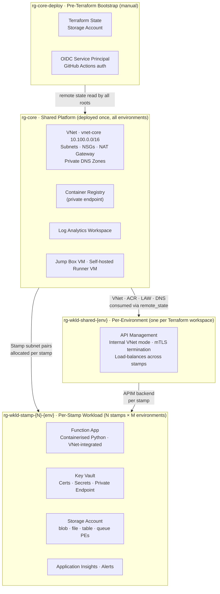

# Azure Cloud Platform Engineering Demo

A fully private, mTLS-secured Azure Function API deployed via Terraform and GitHub Actions CI/CD.

---

## Table of Contents

1. [Architecture](#architecture)
2. [CI/CD Methodology](#cicd-methodology)
3. [Prerequisites](#prerequisites)
4. [Setup & Deployment](#setup--deployment)
   - [Bootstrap](#1-bootstrap-manual)
   - [Core Infrastructure](#2-core-infrastructure-phase1core)
   - [Workload Infrastructure](#3-workload-infrastructure-phase1env--phase3)
   - [Application Deployment](#4-application-deployment)
5. [OIDC Authentication](#oidc-authentication)
6. [Teardown](#teardown)
7. [Assumptions](#assumptions)
8. [Estimated Azure Costs](#estimated-azure-costs)
9. [AI Usage & Critique](#ai-usage--critique)

---

## Architecture

### Design Overview

The solution is structured around four tiers of Azure resource groups, each with a distinct lifecycle and sharing boundary:

- **Bootstrap (`rg-core-deploy`)** — created manually before any Terraform runs. Holds the remote state storage account and the OIDC service principal used by GitHub Actions. Not managed by Terraform.
- **Core (`rg-core`)** — shared platform infrastructure deployed once, environment-agnostic. Hosts the VNet, ACR, Log Analytics, NAT Gateway, jump box, and self-hosted runner.
- **Environment-shared (`rg-wkld-shared-{env}`)** — one per environment (`dev`, `prod`). Contains APIM, which is the single internal entry point for all stamps in that environment.
- **Stamp (`rg-wkld-stamp-{N}-{env}`)** — one per stamp per environment. Each stamp is a self-contained workload unit: Function App, Storage Account, Key Vault, and Application Insights.

**Environments** are managed via Terraform workspaces (`dev`, `prod`). Workspace selection drives which environment-scoped resources are planned and applied — core infrastructure is workspace-independent and deployed once.

**Stamps** are instances of the workload module within an environment. Multiple stamps can be declared per environment via `.tfvars`, and APIM load-balances across them. This design enables horizontal scaling and, with a full hub-spoke network topology, could support multi-region resilience — each stamp deployed to a different Azure region. Hub-spoke is not implemented here (it is out of scope for this assessment), so all stamps currently share a single VNet.

### Logical Architecture



### Components

| Component | Resource | Notes |
|-----------|----------|-------|
| Networking | VNet `vnet-core`, 6 subnet types, NSGs with deny-all | Single VNet, multi-environment via subnet naming |
| Ingress | APIM (Developer tier, internal VNet mode) | Only entry point to the Function App |
| Compute | Azure Function App (Python, Consumption/EP plan) | VNet-integrated, no public access |
| mTLS | Self-signed CA + client cert via `tls` provider | Stored in Key Vault, enforced at APIM |
| Secrets | Azure Key Vault (per stamp, private endpoint) | RBAC auth, no public access |
| Storage | Azure Storage Account (per stamp, private endpoints) | blob, file, table, queue PEs |
| Registry | Azure Container Registry | Private endpoint, no public access |
| Observability | Application Insights + Log Analytics Workspace | Diagnostic settings on all resources |
| Alerting | Azure Monitor alert rule(s) | e.g. error rate / latency |
| CI/CD | GitHub Actions (3 pipelines) | OIDC auth, self-hosted runner for private plane |
| Jump Box | Windows 11 VM (`vm-jumpbox-core`) | Entra ID auth (AADLoginForWindows), public RDP |
| Runner | Ubuntu 22.04 VM (`vm-runner-core`) | Self-hosted GitHub Actions runner, NAT GW egress |

### Terraform Structure

```
terraform/
├── phase1/
│   ├── core/        # Shared infra: VNet, ACR, Log Analytics, NAT GW, jump box, runner VM
│   └── env/         # Per-environment workload: Function App, Storage, Key Vault, APIM
└── phase3/          # Data-plane config: certificates, secrets, APIM policies (self-hosted runner)
modules/
├── vnet/
├── private-dns/
├── workload-stamp/
└── workload-stamp-subnet/
```

---

## CI/CD Methodology

Three GitHub Actions pipelines cover infrastructure and application delivery, authenticated to Azure via OIDC throughout. The deployment is split into three phases that must run in order — the separation is not arbitrary; it is driven by a network bootstrapping constraint.

### Why Three Phases?

Phase 1 creates the self-hosted runner VM (`vm-runner-core`) and injects it into `vnet-core`. Phase 3 must run *on* that runner because it performs data-plane operations against private endpoints — Key Vault secret writes, APIM configuration — that are unreachable from GitHub-hosted runners outside the VNet. You cannot run Phase 3 before Phase 1 has provisioned the runner it depends on.

Terraform also cannot plan Phase 3 resources from outside the VNet: it calls `ListKeys` and lists blob containers on locked-down Storage Accounts during `terraform plan`, which returns 403 from a public IP. Splitting the phases keeps each root's plan/apply runnable on the appropriate runner type.

```
Phase 1 (GitHub-hosted runner)
  → Provisions VNet, self-hosted runner VM, core infra, workload infra

Phase 2 (Manual)
  → Runner VM registered with GitHub Actions
  → Any other one-time steps not automatable pre-runner

Phase 3 (Self-hosted runner — inside VNet)
  → Writes certs/secrets to Key Vault
  → Configures APIM backends and mTLS policy
  → Deploys Monitor alerts and availability tests
```

### Phase 1 — Infrastructure (`phase1/core` + `phase1/env`)

Runs on GitHub-hosted runners. Only requires Azure ARM API access (Terraform control plane) — no private endpoint connectivity needed.

| Sub-phase | Root | What it deploys | Workspace |
|-----------|------|-----------------|-----------|
| 1a — Core | `terraform/phase1/core/` | VNet, ACR, Log Analytics, NAT Gateway, Private DNS, jump box, runner VM | None (deployed once) |
| 1b — Workload | `terraform/phase1/env/` | APIM, Function App, Storage Account, Key Vault, App Insights, Private Endpoints | `dev` / `prod` |

`phase1/core` is workspace-independent and deployed once shared across all environments. `phase1/env` is workspace-driven — `terraform workspace select dev` targets the dev environment, `prod` targets production. Core outputs (VNet, ACR, Log Analytics IDs) are consumed by `phase1/env` via `terraform_remote_state`.

### Phase 2 — Manual Steps

After Phase 1 completes, the following one-time manual step is required before Phase 3 can run:

1. **Create a GitHub PAT** with `repo` scope and add it as the repository secret `RUNNER_PAT`. This token is used by the runner VM to register itself with GitHub Actions.

This phase exists as a named gate so that future manual requirements have a clear home and the overall sequence remains explicit.

### Phase 3 — Data-Plane Operations (`phase3`)

Runs on the self-hosted runner inside `vnet-core`. Reads remote state from both `phase1/core` and `phase1/env` to obtain resource IDs and outputs.

| File | Purpose |
|------|---------|
| `secrets.tf` | Writes CA certificate and client certificate into each stamp's Key Vault (data-plane write, requires VNet access) |
| `apim-config.tf` | Creates APIM backends (one per stamp), API definition, operations, and mTLS client-cert validation policy |
| `alerts.tf` | Azure Monitor metric alerts, App Insights availability tests, Action Group |

### Branch Model & Environment Promotion

```
feature/xyz ──PR──► dev ──PR──► main
                     │              │
               workspace: dev  workspace: prod
               auto-deploy     gated (approval required)
```

Changes flow through `dev` first (auto-applied on merge) then are promoted to `prod` via a deliberate PR from `dev` to `main`. The `main` branch triggers plan → human approval → apply for both infrastructure and application pipelines. Plan files are uploaded to the `tfplans` blob container between the plan and apply steps so the apply executes the exact plan the reviewer inspected.

---

## Prerequisites

- Azure subscription with Owner access
- [Terraform](https://developer.hashicorp.com/terraform/install) >= 1.x
- [Azure CLI](https://learn.microsoft.com/en-us/cli/azure/install-azure-cli) >= 2.x
- [GitHub CLI](https://cli.github.com/) (optional, for secret configuration)
- A public GitHub repository forked from this repo

---

## Setup & Deployment

### 1. Bootstrap (Manual)

> Run once before any Terraform is applied. Creates the pre-Terraform resources that Terraform itself depends on.

```bash
./scripts/prepare-azure-env.sh
```

This script:
- Creates resource group `rg-core-deploy`
- Creates Azure Storage Account for Terraform remote state (containers: `tfstate`, `tfplans`)
- Creates a Service Principal with federated OIDC credentials for GitHub Actions
- Assigns Owner on the subscription and Storage Blob Data Contributor on the state SA

After running, set the following GitHub repository secrets:

| Secret | Value |
|--------|-------|
| `ARM_CLIENT_ID` | Service principal client ID |
| `ARM_TENANT_ID` | Azure tenant ID |
| `ARM_SUBSCRIPTION_ID` | Azure subscription ID |
| `TF_STATE_STORAGE_ACCOUNT` | State storage account name |
| `RUNNER_PAT` | GitHub Personal Access Token with `repo` scope, used by the runner VM to register itself with GitHub Actions |

### 2. Core Infrastructure (`phase1/core`)

> Deploys the shared VNet, ACR, Log Analytics, NAT Gateway, jump box VM, and runner VM.

Either trigger via GitHub Actions (push/merge to `main`) or run locally:

```bash
cd terraform/phase1/core
terraform init
terraform plan -out=tfplan
terraform apply tfplan
```

After apply, register the runner VM with GitHub:
1. SSH to `vm-runner-core` via the jump box using `az ssh vm`
2. Follow GitHub's self-hosted runner registration steps (Settings → Actions → Runners → New self-hosted runner)

### 3. Workload Infrastructure (`phase1/env` + `phase3`)

> Deploys environment-specific resources (Function App, Storage, Key Vault, APIM) and configures mTLS certificates and secrets.

Phase 3 requires the self-hosted runner (reaches private Key Vault and APIM endpoints inside the VNet).

```bash
# phase1/env
cd terraform/phase1/env
terraform workspace select dev   # or prod
terraform plan -var-file=terraform.tfvars -var-file=dev.tfvars -out=tfplan
terraform apply tfplan

# phase3 (after phase1/env completes)
cd terraform/phase3
terraform workspace select dev
terraform plan -var-file=terraform.tfvars -var-file=dev.tfvars -out=tfplan
terraform apply tfplan
```

Or trigger automatically via the workload infrastructure GitHub Actions pipeline on merge to `dev`.

### 4. Application Deployment

> Builds the Docker image, pushes to ACR, and triggers a Function App container refresh via the Kudu webhook.

Triggered automatically by the application pipeline on merge to `dev` (or `main` for prod after approval).

To test the API from the jump box:

```powershell
# From vm-jumpbox-core
./scripts/Test-Application.ps1
```

---

## OIDC Authentication

GitHub Actions authenticates to Azure using OpenID Connect — no long-lived service principal secrets are stored.

### How It Works

1. `prepare-azure-env.sh` creates a Service Principal and configures a **federated identity credential** on it, trusting GitHub as an OIDC issuer.
2. Each GitHub Actions workflow requests a short-lived OIDC token from GitHub's token endpoint.
3. The workflow exchanges this token for an Azure access token using the `azure/login` action with `ARM_USE_OIDC=true`.
4. The access token is scoped to the subscription and expires at the end of the job.

### Required Workflow Permissions

All workflows that authenticate to Azure must include:

```yaml
permissions:
  id-token: write
  contents: read
```

### Federated Credential Configuration

The federated credential is scoped to the repository and branch. The subject claim format is:

```
repo:<org>/<repo>:ref:refs/heads/<branch>
```

Separate credentials are configured for `dev` and `main` branches to enforce least-privilege environment separation.

---

## Teardown

### Standard Teardown

Destroy in reverse dependency order:

```bash
# 1. Phase 3 (data-plane config — certs, secrets)
cd terraform/phase3 && terraform workspace select <env> && terraform destroy

# 2. Phase 1 / env (Function App, Storage, APIM, Key Vault)
cd terraform/phase1/env && terraform workspace select <env> && terraform destroy

# 3. Phase 1 / core (VNet, ACR, VMs, Log Analytics)
cd terraform/phase1/core && terraform destroy
```

### Manual Steps (Beyond `terraform destroy`)

The following resources are **not managed by Terraform** and must be cleaned up manually:

| Resource | Location | Action |
|----------|----------|--------|
| `rg-core-deploy` resource group | Azure Portal | Delete the resource group (contains state SA and SP) |
| Terraform state storage account | Inside `rg-core-deploy` | Deleted with the resource group above |
| Service Principal | Entra ID → App Registrations | Delete the SP and its federated credentials |
| GitHub Actions self-hosted runner | GitHub repo → Settings → Runners | Remove the runner registration |
| GitHub repository secrets | GitHub repo → Settings → Secrets | Delete `ARM_*` and `TF_STATE_STORAGE_ACCOUNT` secrets |

> **Soft-delete note:** Azure Key Vault has soft-delete enabled by default (90-day retention). If you need to re-deploy to the same subscription with the same Key Vault name, you may need to purge the deleted vault: `az keyvault purge --name <kv-name> --location uksouth`

---

## Assumptions

The following assumptions were made during implementation. See [docs/0_Constraints-and-Assumptions.md](docs/0_Constraints-and-Assumptions.md) for the full constraint and assumption register.

| ID | Assumption |
|----|------------|
| A-1 | A single Azure subscription and tenant are used for all environments. |
| A-2 | The implementer has Owner access to the subscription. |
| A-3 | All resources are greenfield — no existing VNet, Key Vault, or shared infrastructure is reused. |
| A-4 | DNS resolution for Private Endpoints uses Azure-provided Private DNS Zones; no custom DNS server. |
| A-5 | The API is consumed only by clients within the same VNet. No cross-VNet or on-premises peering. |
| A-6 | Single region (`uksouth`) deployment. Multi-region is out of scope. |
| A-7 | No data residency or compliance requirements beyond those in the spec. |
| A-8 | The Function App uses the Elastic Premium (EP1) plan to support VNet integration on Consumption pricing. |
| A-9 | GitHub OIDC federated credentials and repository secrets are configured manually (documented, not automated). |
| A-10 | The self-hosted runner VM is registered with GitHub manually after Terraform provisioning. |
| A-11 | Hub/Spoke topology is not implemented. Shared and workload infrastructure share a single VNet (`vnet-core`). In production this would be separated. |
| A-12 | The jump box has a public RDP endpoint. In production this would be replaced with Azure Bastion. |

---

## Estimated Azure Costs

> Estimates are approximate (UK South, Pay-As-You-Go) as of early 2026. Actual costs depend on usage and data volumes.

| Resource | SKU / Plan | Est. Monthly Cost |
|----------|------------|-------------------|
| API Management | Developer tier | ~£50 |
| Function App | Elastic Premium EP1 | ~£120 |
| Azure Container Registry | Basic tier | ~£4 |
| Azure Key Vault | Standard, ~10 operations/day | <£1 |
| Storage Account (state + function) | LRS, minimal data | ~£2 |
| Log Analytics Workspace | Pay-per-GB, minimal ingestion | ~£2 |
| Application Insights | Pay-per-GB | ~£1 |
| NAT Gateway | Standard, ~1 GB egress | ~£30 |
| Jump Box VM | Standard_B2s, Windows 11 | ~£35 |
| Runner VM | Standard_B2s, Ubuntu 22.04 | ~£30 |
| Private DNS Zones | ~10 zones | ~£5 |
| Public IPs | 2 (NAT GW + jump box) | ~£6 |
| **Total (estimate)** | | **~£285/month** |

> **Cost reduction options:** APIM Consumption tier (~£0 + per-call charges) instead of Developer tier saves ~£50/month. Deallocating the jump box and runner VMs when not in use eliminates ~£65/month. Tear down non-production stamps when not needed.

---

## AI Usage & Critique

This project made use of AI coding assistants (Claude Sonnet via Claude Code) throughout the implementation. Per the assessment requirements (DC-7), the prompt log and a technical critique of AI output are documented below.

### Prompt Log

See [AI_Prompt_Log.md](AI_Prompt_Log.md) for a full record of prompts used during implementation.

### Technical Critique of AI Output

The following issues were identified and corrected in AI-generated Terraform and scripts:

| Area | Issue | Action Taken |
|------|-------|-------------|
| _To be completed during implementation_ | | |

#### Common Patterns Observed

- **Overly permissive NSG rules:** AI tended to suggest `*` source/destination instead of specific CIDRs or service tags. All NSG rules were reviewed and tightened to least-privilege.
- **Missing `private_endpoint_network_policies`:** AI-generated subnet resources frequently omitted `private_endpoint_network_policies = "Enabled"`, which silently disables NSG enforcement on PE subnets.
- **Public access not explicitly disabled:** Resources such as Key Vault and Storage Accounts required explicit `public_network_access_enabled = false` — AI often defaulted to public access or omitted the attribute.
- **Hardcoded values:** AI occasionally hardcoded subscription IDs, tenant IDs, or location strings rather than using variables. All were replaced with parameterised inputs.
- **Non-idiomatic Terraform:** Some generated code used `count` where `for_each` would be more appropriate for named resources, increasing risk of resource replacement on reorder.
