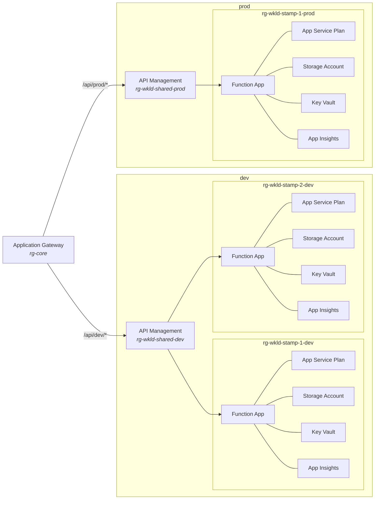
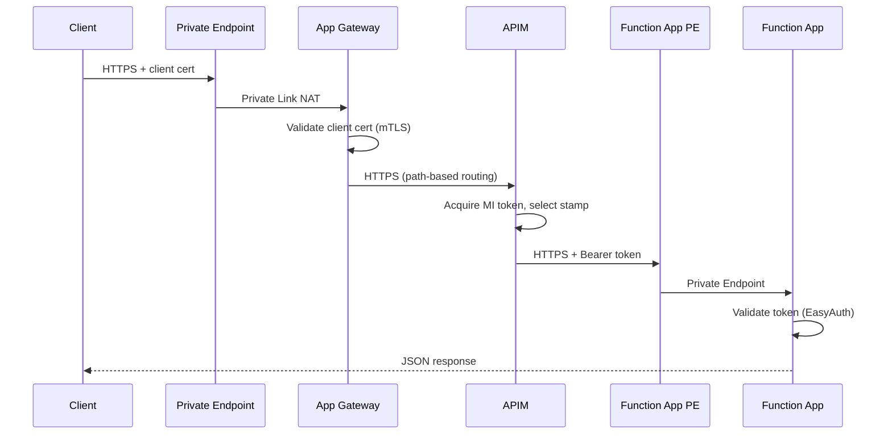
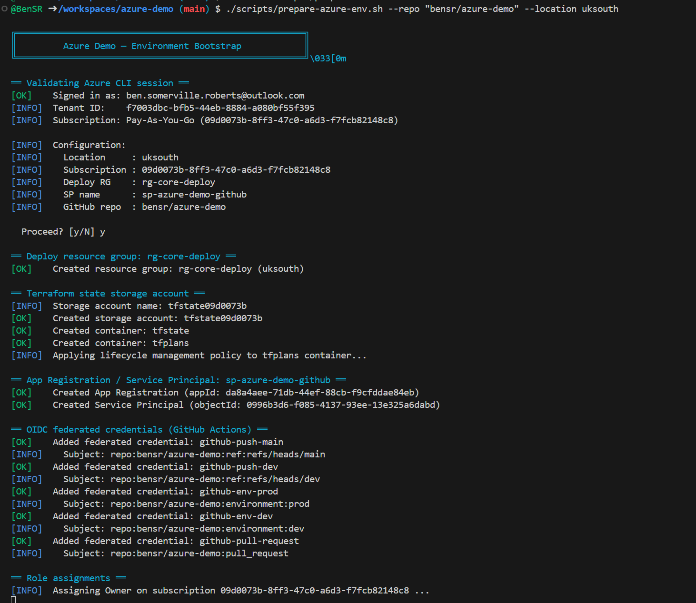
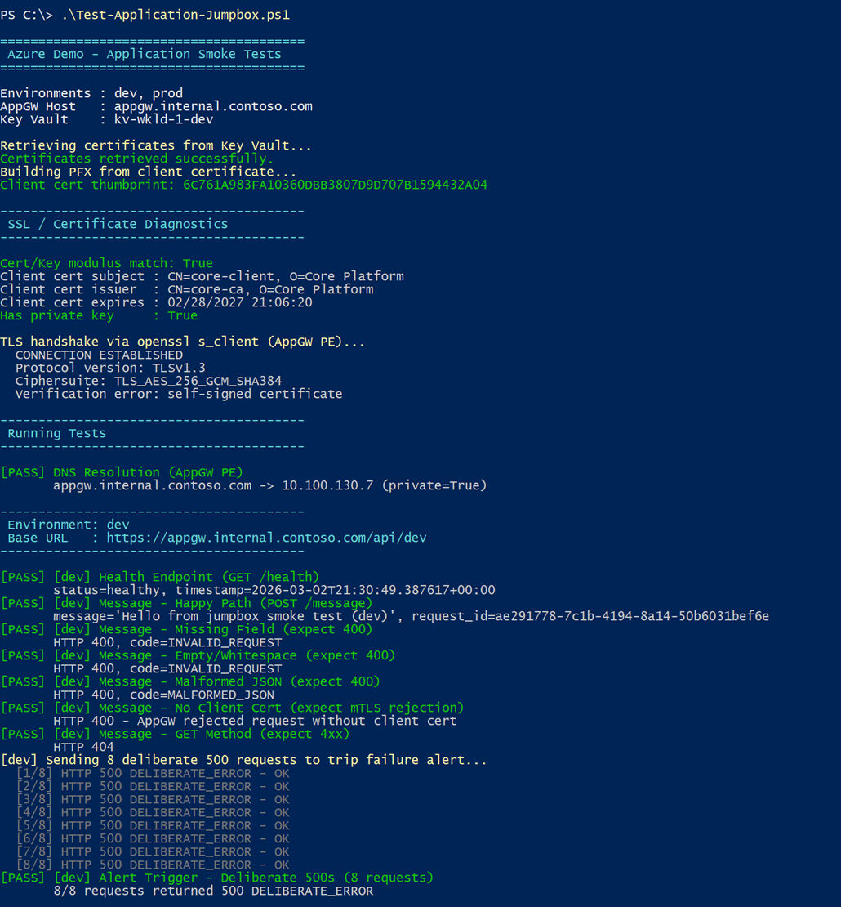

# Azure Cloud Platform Engineering Demo

A fully private, mTLS-secured Azure Function API deployed via Terraform and GitHub Actions.

---

## Table of Contents

1. [Architecture](#architecture)
2. [Prerequisites](#prerequisites)
3. [Setup & Deployment](#setup--deployment)
   - [Bootstrap](#1-bootstrap-manual-one-time)
   - [Configure GitHub](#2-configure-github)
   - [Deploy via Pipelines](#3-deploy-via-pipelines)
   - [Pipelines](#pipelines)
4. [OIDC Authentication](#oidc-authentication)
5. [Teardown](#teardown)
6. [Assumptions](#assumptions)
7. [Estimated Azure Costs](#estimated-azure-costs)
8. [AI Usage & Critique](#ai-usage--critique)

---

## Architecture

### Overview

The solution exposes an internal API (Python Azure Function) through APIM with mTLS enforcement, fronted by an Application Gateway for public ingress. All PaaS services are fully private — no public endpoints.

Infrastructure is organised into four resource group tiers, each with a distinct lifecycle:

| Tier | Resource group | Contents | Deployed by |
|------|----------------|----------|-------------|
| Bootstrap | `rg-core-deploy` | Terraform state storage, OIDC service principal | Manual (bootstrap script) |
| Core | `rg-core` | VNet, ACR, Log Analytics, NAT GW, DNS zones, VMs | Phase 1 (core) |
| Env-shared | `rg-wkld-shared-{env}` | APIM (per-environment) | Phase 1 (env) |
| Stamp | `rg-wkld-stamp-{N}-{env}` | Function App, Storage, Key Vault, App Insights | Phase 1 (env) |

Environments (`dev`, `prod`) are managed via Terraform workspaces. Stamps are repeatable workload instances within an environment — APIM load-balances across them.

### Solution Topology



The Application Gateway (`rg-core`) is the single ingress point. It terminates mTLS and routes by URL path to the correct environment's APIM instance. Each APIM load-balances across its stamps — dev has two, prod has one. Every stamp is a self-contained resource group with its own compute, storage, secrets, and telemetry. The `rg-core` resource group also contains the shared VNet, Container Registry, Log Analytics Workspace, NAT Gateway, Private DNS zones, self-hosted runner, and jump box — all deployed once and consumed by every environment.

All resources sit within a single `/16` VNet. Each stamp gets a dedicated subnet pair (Private Endpoint + App Service Plan) with per-subnet NSGs enforcing deny-all baselines. Only the self-hosted runner has internet egress (via NAT Gateway). All PaaS services are accessed exclusively through Private Endpoints.

### Request Flow



> **mTLS termination and SSL re-encryption:** The Application Gateway terminates the client's TLS session and validates the client certificate against the project CA. It then establishes a *new* HTTPS connection to APIM, presenting the project CA as the trusted root for backend certificate verification. This SSL re-encryption is necessary because APIM uses a custom hostname (`apim-wkld-shared-{env}.internal.contoso.com`) with a CA-signed gateway certificate — the AppGW must verify this to maintain end-to-end trust. APIM in turn opens another HTTPS connection to the Function App Private Endpoint, attaching a Managed Identity bearer token. The Function App validates this token via Entra ID EasyAuth before processing the request.
>
> **Path-based routing:** The AppGW uses URL path rules (`/api/dev/*`, `/api/prod/*`) with rewrite rules that strip the environment prefix, so APIM receives clean `/api/message` or `/api/health` paths regardless of environment.
>
> **Health endpoint:** `GET /api/health` bypasses Managed Identity authentication at the APIM layer — the health-check operation policy intentionally omits the API-level inbound base policy, so no Entra token is acquired or forwarded. The AppGW health probes also bypass mTLS because they connect directly to APIM backends rather than traversing the HTTPS listener. However, an external client calling `/api/health` through the normal request path still needs a valid client certificate — mTLS is enforced at the listener for all paths. This separation allows the AppGW to detect stamp failures without credentials, while still protecting the health endpoint from unauthenticated external access.

---

## Prerequisites

| Requirement | Detail |
|-------------|--------|
| Azure subscription | Owner or Contributor + User Access Administrator |
| Azure CLI | v2.55+ (for bootstrap script only) |
| GitHub repo | Public, with Actions enabled |
| `jq` | Used by the bootstrap script |

Terraform, Docker, and all other tooling runs in CI — nothing to install locally beyond the bootstrap dependencies.

---

## Setup & Deployment

All infrastructure and application deployment is handled by GitHub Actions pipelines. The only manual steps are the one-time bootstrap and GitHub configuration.

### 1. Bootstrap (manual, one-time)

The bootstrap script creates the resources that must exist before any pipeline can run:

```bash
bash scripts/prepare-azure-env.sh \
  --repo <owner/repo> \
  --location northeurope
```

This creates:
- `rg-core-deploy` resource group
- Terraform state storage account (+ `tfstate` and `tfplans` containers)
- App Registration + Service Principal with OIDC federated credentials
- Role assignments: Owner (subscription), Storage Blob Data Contributor (state SA), Application Developer + Directory Readers (Entra ID), Microsoft Graph `Application.ReadWrite.All`

The script prints the GitHub secrets and environments to configure (see [OIDC Authentication](#oidc-authentication)).



### 2. Configure GitHub

Add the following as GitHub Actions repository secrets:

| Secret | Value |
|--------|-------|
| `ARM_CLIENT_ID` | App Registration client ID (from bootstrap output) |
| `ARM_TENANT_ID` | Entra ID tenant ID |
| `ARM_SUBSCRIPTION_ID` | Target subscription ID |
| `TF_STATE_STORAGE_ACCOUNT` | State storage account name |
| `RUNNER_MANAGEMENT_PAT` | GitHub PAT with `manage_runners:repo` scope |

Create two GitHub environments:
- **`dev`** — no approval gates
- **`prod`** — add required reviewers

### 3. Deploy via Pipelines

Once bootstrap and GitHub configuration are complete, all deployment is driven by pushing code to branches. There are no manual Terraform commands to run.

#### Initial deployment sequence

For a fresh environment, merge changes in this order — each push triggers the relevant pipeline:

| Step | Action | Pipeline triggered | What it deploys |
|------|--------|--------------------|-----------------|
| 1 | Merge `terraform/phase1/core/` to `main` | **Infra — Core — Prod Apply** | VNet, ACR, LAW, DNS zones, NAT GW, certs, jump box, self-hosted runner |
| 2 | Wait for runner to self-register | — | The runner VM registers with GitHub Actions via Custom Script Extension (~2-3 min) |
| 3 | Merge `terraform/phase1/env/` + `phase2/` + `phase3/` to `dev` | **Infra — Env — Dev Apply** | Phase 1 (APIM, stamps) → Phase 2 (config, secrets, alerts). Phase 3 skipped on dev. |
| 4 | Merge the same to `main` | **Infra — Env — Prod Apply** | Three gated tiers: Phase 1 → Phase 2 → Phase 3 (App GW). Each requires approval. |
| 5 | Merge `function_app/` to `dev` | **App — Dev Deploy** | Test → build → push `:dev` to ACR → webhook deploy to dev stamps |
| 6 | Merge `function_app/` to `main` | **App — Prod Deploy** | Test → build → push `:latest` to ACR → approval gate → webhook deploy to prod stamps |

#### Ongoing changes

After initial deployment, the pipelines are path-scoped — only the affected pipeline runs:

- Change Terraform code → infrastructure pipeline runs
- Change `function_app/` → application pipeline runs
- Open a PR → validation pipeline runs (fmt, validate, `terraform test`, pytest)

### Pipelines

Eight GitHub Actions workflows handle the full lifecycle. See [docs/2_CI-CD-Approach.md](docs/2_CI-CD-Approach.md) for the complete design.

| Workflow | Trigger | Runner | Behaviour |
|----------|---------|--------|-----------|
| **Infra — Validate** | PR / feature push | GitHub-hosted | fmt, validate, `terraform test` (no Azure creds needed) |
| **Infra — Core — Dev Plan** | Push to `dev` | GitHub-hosted | Plan only (core has no dev workspace) |
| **Infra — Core — Prod Apply** | Push to `main` | GitHub-hosted | Plan → approval → apply |
| **Infra — Env — Dev Apply** | Push to `dev` | Mixed | Phase 1 + Phase 2 auto-apply (Phase 3 skipped) |
| **Infra — Env — Prod Apply** | Push to `main` | Mixed | 3 sequential gated tiers: Phase 1 → 2 → 3 |
| **App — PR Validate** | PR to `dev`/`main` | Mixed | pytest + trial Docker build (image discarded) |
| **App — Dev Deploy** | Push to `dev` | Mixed | Test → build → push `:dev` → webhook deploy |
| **App — Prod Deploy** | Push to `main` | Mixed | Test → build → push `:latest` → approval → webhook deploy |

#### Branch model

```
feature/xyz ──PR──► dev ──PR──► main
                     │             │
                  auto-deploy    gated (approval required)
```

#### Runner selection

Jobs that only talk to the Azure Resource Manager API (plan/apply for Phase 1, validation) run on **GitHub-hosted** runners. Jobs that need VNet access (Phase 2+3 apply, Docker build+push, webhook deploy) run on the **self-hosted** runner inside the VNet.

### Smoke Tests

After deployment, end-to-end smoke tests can be run from the jump box to validate the full request path (DNS → AppGW mTLS → APIM → Function App). The test script (`scripts/Test-Application-Jumpbox.ps1`) exercises health, message, validation, mTLS enforcement, and alert-trigger endpoints for each environment.



---

## OIDC Authentication

GitHub Actions authenticates to Azure using OpenID Connect — no long-lived secrets.

### How it works

1. The bootstrap script creates an App Registration with federated credentials for each GitHub Actions context (branch push, environment, pull request).
2. Workflows use `azure/login@v2` with OIDC, exchanging a GitHub-issued JWT for an Azure access token.
3. The JWT subject claim (`repo:<owner>/<repo>:ref:refs/heads/<branch>` or `:environment:<env>`) is validated against the registered federated credentials.

### Federated Credentials

| Credential | Subject | Used by |
|------------|---------|---------|
| `github-push-main` | `repo:<owner/repo>:ref:refs/heads/main` | Infra plan on main push |
| `github-push-dev` | `repo:<owner/repo>:ref:refs/heads/dev` | Infra plan on dev push |
| `github-env-prod` | `repo:<owner/repo>:environment:prod` | Gated apply to prod |
| `github-env-dev` | `repo:<owner/repo>:environment:dev` | Auto-apply to dev |
| `github-pull-request` | `repo:<owner/repo>:pull_request` | PR validation |

### Service Principal Permissions

| Permission | Scope | Why |
|------------|-------|-----|
| Owner | Subscription | Create resources + assign RBAC roles |
| Storage Blob Data Contributor | State storage account | Read/write Terraform state + plan files |
| Application Developer | Entra ID directory | Create app registrations (EasyAuth) |
| Directory Readers | Entra ID directory | Resolve users/groups in Terraform |
| Application.ReadWrite.All | Microsoft Graph | Create service principals for app registrations |

---

## Teardown

Teardown is not yet pipelined — it requires running `terraform destroy` in reverse phase order. Phase 2 and Phase 3 destroys must run from the self-hosted runner (private endpoint access required), so destroy core last.

### Prerequisites

Each `terraform destroy` requires a prior `terraform init` with backend configuration. For phases that use a partial backend (phase 3), pass the backend config explicitly:

```hcl
# backend.hcl (same for all phases)
resource_group_name  = "rg-core-deploy"
storage_account_name = "<your-state-storage-account>"
container_name       = "tfstate"
key                  = "phase3.tfstate"   # adjust per phase
```

```bash
# Example: initialise phase 3 before destroy
terraform -chdir=terraform/phase3 init -backend-config=backend.hcl
```

### Step 1 — Destroy via the self-hosted runner

SSH into the runner VM (or use the jump box to reach it) and run:

```bash
# Application Gateway (phase 3)
terraform -chdir=terraform/phase3 destroy -var-file=terraform.tfvars

# Config, secrets, alerts — each workspace (phase 2)
for env in prod dev; do
  terraform -chdir=terraform/phase2/env workspace select "$env"
  terraform -chdir=terraform/phase2/env destroy \
    -var-file=terraform.tfvars -var-file="${env}.tfvars"
done
```

### Step 2 — Destroy environment and core infrastructure

These only need ARM API access, so they can run from any machine with Azure CLI auth:

```bash
# Environment infrastructure — each workspace (phase 1 env)
for env in prod dev; do
  terraform -chdir=terraform/phase1/env workspace select "$env"
  terraform -chdir=terraform/phase1/env destroy \
    -var-file=terraform.tfvars -var-file="${env}.tfvars"
done

# Core infrastructure (phase 1 core) — destroy last
terraform -chdir=terraform/phase1/core destroy
```

### Step 3 — Manual cleanup

These resources exist outside Terraform and must be removed manually:

| Resource | How to remove |
|----------|---------------|
| `rg-core-deploy` (state storage) | `az group delete --name rg-core-deploy` |
| App Registration + Service Principal | `az ad app delete --id <APP_ID>` |
| Entra ID role assignments | Removed automatically when the SP is deleted |
| GitHub Actions secrets | Repository → Settings → Secrets |
| GitHub environments (`dev`, `prod`) | Repository → Settings → Environments |
| Self-hosted runner registration | Auto-deregisters when VM is destroyed; or manually via GitHub Settings → Actions → Runners |

### Ordering constraints

- **Phase 2 before Phase 1** — Phase 2 resources (APIM config, KV secrets) must be destroyed before Phase 1, which owns the APIM and Key Vault instances they depend on.
- **Phase 3 before Phase 1 core** — The App GW subnet and NSG rules reference the core VNet.
- **Core last** — The self-hosted runner lives in Phase 1 core and must remain available until Phase 2 and Phase 3 are destroyed.

---

## Assumptions

| ID | Assumption |
|----|------------|
| A-1 | A single Azure subscription and tenant are available for deployment. |
| A-2 | The implementer has Owner or Contributor access to the target Azure subscription. |
| A-3 | All resources are greenfield — no existing VNet, Key Vault, or shared infrastructure to reuse. |
| A-4 | DNS resolution for Private Endpoints uses Azure Private DNS Zones (no custom DNS server). |
| A-5 | The API is consumed only by clients within the same VNet or via the Application Gateway (no cross-VNet or on-premises peering). |
| A-6 | Single region deployment (North Europe). Multi-region is out of scope. |
| A-7 | No data residency or compliance requirements beyond what the spec states. |
| A-8 | GitHub repository secrets and environments are configured manually (documented, not automated). |
| A-9 | Global resource naming collisions (e.g. storage accounts) are accepted as unlikely — a clash at apply time is immediately obvious. |
| A-10 | A Windows jump box with Entra ID RDP is used instead of VPN Gateway or Bastion for VNet access — avoids the complexity of private DNS resolvers. |

---

## Estimated Azure Costs

Monthly cost estimate for a single environment (dev, 2 stamps). Prices are approximate (UK South / North Europe, pay-as-you-go).

| Resource | SKU | Approx. monthly cost |
|----------|-----|---------------------|
| APIM | Developer | ~£37 |
| ACR | Premium | ~£42 |
| App Service Plan (×2) | B1 | ~£24 (£12 each) |
| Application Gateway | Standard_v2 (1 unit) | ~£140 |
| Jump box VM | Standard_B2s | ~£27 |
| Runner VM | Standard_B2s | ~£27 |
| Log Analytics | PerGB2018 | ~£2 (low volume) |
| Storage Accounts (×2) | Standard_LRS | ~£2 |
| Key Vaults (×3) | Standard | ~£0 (pay-per-operation) |
| NAT Gateway + Public IPs (×3) | Standard | ~£30 + £10 |
| Private Endpoints (×13) | — | ~£10 |
| App Insights (×2) | — | ~£0 (included in LAW) |
| **Total (1 env)** | | **~£350/month** |

> **Cost-saving notes:**
> - Stop VMs when not in use (`az vm deallocate`) — saves ~£54/month.
> - The Application Gateway is the single largest cost. In a real assessment environment, deploy it last and destroy it first.
> - APIM Developer tier has no SLA and is not suitable for production.
> - Adding a `prod` environment roughly doubles stamp and APIM costs (~£130 more), but core resources (VNet, ACR, LAW, VMs, App GW, NAT GW) are shared.

---

## AI Usage & Critique

AI coding assistants (GitHub Copilot with Claude) were used extensively throughout this project. A full prompt log is maintained in [AI_Prompt_Log.md](AI_Prompt_Log.md).

### How AI was used

| Phase | Usage |
|-------|-------|
| Requirements extraction | Extracted and structured requirements from the specification |
| Solution design | Generated initial design docs, refined through iterative prompting |
| Implementation planning | Module structure, naming conventions, workspace strategy |
| Terraform code | Generated initial module and root code, heavily reviewed and refactored |
| Python Function App | Generated initial app code and tests |
| CI/CD workflows | Generated GitHub Actions workflow files |
| Documentation | Generated and updated documentation to reflect actual implementation |

### Critique of AI Output

| Pattern | Observation | Mitigation |
|---------|-------------|------------|
| Over-modularisation | AI tends to wrap everything in modules, even singletons (ACR, LAW). Adds indirection without reuse benefit. | Explicit instruction to only modularise where reuse is expected. |
| Permissive defaults | Generated NSG rules were too broad (e.g. `*` for source). Storage accounts defaulted to public access. | Manual review hardened all security posture. Deny-all baseline added. |
| Stale provider knowledge | Some generated code used deprecated attributes or old provider syntax. | Ran `terraform validate` and fixed issues. |
| Missing cross-cutting concerns | AI-generated modules didn't account for cross-subnet NSG rules (e.g. APIM → Function App). | Added `workload-stamp-subnet` module to handle cross-cutting rules. |
| Hallucinated resources | Occasionally referenced Azure resources or attributes that don't exist in the provider. | Caught by `terraform validate` and plan. |
| Doc drift | AI-generated docs described intended design, not actual implementation. Phase numbering, resource names, and feature completeness diverged. | Full doc refresh against actual codebase. |
| Naming inconsistency | Generated code didn't follow the stated naming convention consistently. | Manual pass to enforce `<abbr>-wkld-<N>-<env>` pattern. |

### Selected Prompt Examples

Below are representative prompts that illustrate the patterns above, with specific critique of what the AI produced.

**1. Infrastructure generation — permissive defaults and missing cross-cutting concerns**

> *"Please now create all the Phase 1 terraform to support the deployment of the app as described in the docs."*

The AI generated syntactically valid Terraform with correct resource types, but NSG rules used `source_address_prefix = "*"` and `destination_address_prefix = "VirtualNetwork"` — far too broad for an internal-only architecture. Storage accounts were created with `public_network_access_enabled` defaulting to `true`. The generated modules also had no awareness of cross-subnet dependencies (e.g. APIM needing to reach Function App PEs in stamp subnets), because the AI treated each module as self-contained. **Fix:** Manual security hardening pass to add deny-all baselines, explicit per-source allow rules, and a new `workload-stamp-subnet` module specifically for cross-cutting NSG rules.

**2. Resource group refactoring — AI couldn't infer shared-vs-per-env boundaries**

> *"I think we need to refactor some of the docs and infra. I am not happy with some of the resources which would likely be shared between environments, like the ACR or Log Analytics, being named 'dev'."*

The AI initially placed all resources (ACR, Log Analytics, VNet) into environment-scoped resource groups, resulting in duplicate shared infrastructure per workspace. It didn't distinguish between resources with a global lifecycle (VNet, ACR, LAW) and those that vary per environment (APIM, stamps). **Fix:** Introduced the 4-tier resource group model (bootstrap → core → env-shared → stamp) and restructured into phase1/core (shared) and phase1/env (per-workspace).

**3. Documentation drift — described intent, not implementation**

> *"Please create a document called `2_azure_infra_bom.md` which captures a complete bill of materials for the Azure infrastructure."*

The generated BoM listed resources from the design docs that hadn't been built yet, used naming conventions that didn't match the actual code, and included resources (e.g. availability web test) that were only partially implemented. Phase numbers and resource counts were aspirational rather than factual. **Fix:** Full documentation refresh against the live codebase, verifying every resource name, count, and configuration against `terraform state list` output.

**4. Hallucinated provider attributes**

> *"Please now create all the terraform to support the deployment of the app as described in the doc suite."*

The AI generated Terraform referencing attributes like `azurerm_function_app.auth_settings_v2` blocks with incorrect nested schema (e.g. `active_directory_v2.client_secret_setting_name` where the provider expects `client_secret_certificate_thumbprint`), and used `azurerm_api_management_api_policy` with an XML body containing unsupported APIM policy elements. **Fix:** Caught immediately by `terraform validate` and `terraform plan`; corrected by consulting the provider documentation.

---

## Documentation

Detailed design and planning documents are in the [docs/](docs/) directory:

| Document | Content |
|----------|---------|
| [Functional Requirements](docs/0_Functional-Requirements.md) | What the system shall do |
| [Nonfunctional Requirements](docs/0_Nonfunctional-Requirements.md) | Security, reliability, maintainability |
| [Constraints & Assumptions](docs/0_Constraints-and-Assumptions.md) | Project boundaries and working assumptions |
| [Solution Design](docs/1_Infrastructure-Solution-Design.md) | Architecture decisions and design rationale |
| [Technical Design](docs/1_Infrastructure-Technical-Design.md) | Network topology, NSG rules, DNS |
| [Implementation Planning](docs/1_Infrastructure-Implementation-Planning.md) | Module structure, phases, workspace workflow |
| [Bill of Materials](docs/1_Azure-Infrastructure-Bill-of-Materials.md) | Complete Azure resource inventory |
| [APIM Planning](docs/2_APIM-Planning.md) | API Management configuration and auth flow |
| [Application Planning](docs/2_Application-Planning.md) | Function App design, API spec, observability |
| [CI/CD Approach](docs/2_CI-CD-Approach.md) | Pipeline design, runners, promotion model |
| [Gap Analysis](docs/3_Gap-Analysis.md) | Requirements vs. delivered solution |
