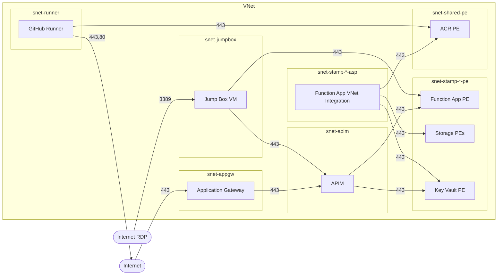

# Network Technical Design

Network topology, subnet layout, NAT Gateway strategy, NSG design principles, and traffic flow model.

---

## 1. Design Principles

| Principle | How |
|-----------|-----|
| **Zero public PaaS exposure** | All PaaS services behind Private Endpoints. APIM internal VNet mode. Function App and Storage with public access disabled. |
| **Least-privilege NSGs** | One NSG per subnet. Explicit deny at priority 4000; allow only the minimum traffic each subnet requires. |
| **Deterministic egress** | NAT Gateway attached to all subnets for consistent routing, but only the runner and jumpbox NSGs allow internet-bound traffic. |
| **Private DNS resolution** | 8 Private DNS Zones (7 privatelink + `internal.contoso.com` for APIM) linked to the VNet. All subnets resolve via Azure DNS. |
| **PE network policies** | Enabled on PE subnets so NSG rules apply to Private Endpoint traffic (without this, NSG rules are silently ignored on PE NICs). |

---

## 2. VNet Design

A single shared VNet hosts all environments. Core infrastructure and all stamp subnets from every environment coexist — distinguished by environment name in the subnet name (e.g. `snet-stamp-dev-1-pe` vs `snet-stamp-prod-1-pe`).

The address space is a `/16`, providing room for many stamps across environments:
- **Lower range** — stamp subnets, allocated sequentially per environment
- **Upper range** — fixed shared subnets (runner, jumpbox, APIM, shared PE, App GW)

---

## 3. Subnet Layout

### Fixed Subnets (created by `modules/vnet`)

| Subnet | Size | Delegation | Purpose |
|--------|------|-----------|---------|
| `snet-runner` | /24 | None | Self-hosted GitHub Actions runner VM. NAT GW for internet egress. |
| `snet-jumpbox` | /27 | None | Windows 11 jump box for developer connectivity. |
| `snet-apim` | /27 | `Microsoft.ApiManagement/service` | APIM internal VNet mode (Developer tier). |
| `snet-shared-pe` | /24 | None | Private Endpoints for shared resources (ACR PE only). |

### Per-Stamp Subnets (created by `modules/workload-stamp-subnet`)

One pair per stamp per environment. Names include the environment to allow coexistence in the shared VNet.

| Pattern | Delegation | Purpose |
|---------|-----------|---------|
| `snet-stamp-<env>-<N>-pe` | None | PEs for Function App, Storage (blob/file/table/queue), Key Vault. PE network policies enabled. |
| `snet-stamp-<env>-<N>-asp` | `Microsoft.Web/serverFarms` | ASP VNet integration — Function App outbound traffic originates here. |

### Phase 3 Subnet (created by `phase3/network.tf`)

| Subnet | Size | Purpose |
|--------|------|---------|
| `snet-appgw` | /27 | Application Gateway with public ingress and outbound to APIM. |

### Key Configuration Notes

- **PE subnets**: `private_endpoint_network_policies = "Enabled"` — required for NSG enforcement on Private Endpoint NICs.
- **ASP subnets**: Delegation is mandatory for App Service VNet integration. Inbound to the Function App arrives at the PE subnet, not here.
- **APIM subnet**: `/27` is the minimum for Developer tier. Delegation mandatory.
- **Runner subnet**: No delegation. Hosts the GitHub Actions runner provisioned via Custom Script Extension.

---

## 4. NAT Gateway

A single NAT Gateway with a static Public IP is attached to all subnets. However, **only the runner and jumpbox** have NSG rules permitting internet egress. All other subnets deny internet-bound traffic at the NSG level.

| Subnet | Internet egress? | Why |
|--------|-----------------|-----|
| Runner | **Yes** | GitHub API, package repos, Azure ARM API, Docker builds |
| Jumpbox | **Limited** | HTTPS/HTTP only — Azure CLI, Windows Update, Entra ID |
| Stamp PE | No | PEs are inbound-only listeners |
| Stamp ASP | No | Function App talks only to PEs and Azure Monitor via service tags |
| APIM | No | Platform dependencies via service tags, not internet routes |
| Shared PE | No | PE listeners only |
| App GW | Limited | Outbound to APIM subnet and shared PE only; GatewayManager inbound |

---

## 5. Traffic Flow Summary

### Key Traffic Flows

| Source → Destination | Port | Purpose |
|---------------------|------|---------|
| Internet → App GW | 443 | Public mTLS ingress |
| App GW → APIM | 443 | Forwarded API requests (env prefix stripped) |
| APIM → Stamp PE subnet | 443 | Function App PE invocation + Key Vault cert reads |
| Stamp ASP → Stamp PE | 443 | Function App → Storage PEs + Key Vault PE |
| Stamp ASP → Shared PE | 443 | Function App → ACR PE (image pull) |
| Stamp ASP → AzureMonitor | 443 | App Insights telemetry (service tag) |
| Runner → Shared PE | 443 | ACR image push |
| Runner → Stamp PE | 443 | KV data-plane ops (Phase 2 Terraform) |
| Runner → Internet | 443, 80 | GitHub, package repos, Azure ARM API |
| Jumpbox → all PE subnets + APIM | 443 | Diagnostics and API testing |
| Internet → Jumpbox | 3389 | RDP access (Entra ID authenticated) |
| All subnets → Azure DNS | 53 | Private DNS Zone resolution |

---

## 6. NSG Design

Each subnet has a dedicated NSG. NSG names are derived from the VNet name: `nsg-core-<subnet-suffix>` for fixed subnets, `nsg-core-stamp-<env>-<N>-<pe|asp>` for stamp subnets.

### Management Split

- **Fixed-subnet NSG rules**: defined in `phase1/core/network.tf`
- **Per-stamp NSG rules** (and cross-cutting rules on shared NSGs): generated by `modules/workload-stamp-subnet`, called once per stamp via `for_each`. Priority offsets (`stamp_index × 1`) prevent collisions.
- **App GW NSG rules**: defined in `phase3/network.tf`, including cross-cutting rules on the APIM and shared-PE NSGs.

### Per-Subnet Summary

**Stamp PE** — Inbound: allow APIM, own ASP, runner, jumpbox on 443. Outbound: deny-all (PEs don't initiate connections).

**Stamp ASP** — Inbound: allow Azure Load Balancer. Outbound: allow to own stamp PE, shared PE, AzureMonitor on 443; allow DNS; deny internet.

**APIM** — Inbound: allow VNet clients on 443, ApiManagement on 3443 (mandatory), AzureLoadBalancer health probes (mandatory), jumpbox on 443, App GW on 443. Outbound: allow to stamp PEs, shared PE, and mandatory service tags (Storage, Sql, EventHub, AzureMonitor, AzureAD, AzureKeyVault); allow DNS.

**Shared PE** — Inbound: allow from stamp ASP subnets, runner, APIM, jumpbox, App GW on 443. Outbound: deny-all.

**Runner** — Inbound: allow SSH from jumpbox only. Outbound: allow to shared PE, stamp PEs, internet (HTTPS/HTTP), DNS.

**Jumpbox** — Inbound: allow RDP from internet. Outbound: allow to stamp PEs, shared PE, APIM on 443; allow AzureAD, DNS, internet HTTPS/HTTP; deny remaining internet.

**App GW** — Inbound: allow GatewayManager (mandatory), internet HTTPS, AzureLoadBalancer. Outbound: allow to APIM and shared PE subnets, internet HTTPS, DNS.

---

## 7. Design Trade-offs

### NSG Granularity

NSGs operate at subnet level, not per-PE. An allow rule for `ASP → Stamp PE:443` grants access to *all* PEs in that subnet. Truly granular PE isolation would require separate subnets or Application Security Groups. The pragmatic decision is to accept subnet-level granularity — defence in depth (disabled public access, EasyAuth, Managed Identity) covers the gap.

### APIM Mandatory Rules

APIM in internal VNet mode requires specific outbound connectivity to Azure platform services via service tags. No custom deny-all-outbound is added to the APIM NSG — the explicit allow rules for mandatory tags at lower priority numbers take precedence over Azure's default deny at 65500.

### DNS Resolution

All subnets allow outbound to Azure DNS (port 53). This is the platform resolver that serves Private DNS Zone records and forwards non-private queries to public DNS. Without it, private endpoint FQDN resolution breaks entirely.
