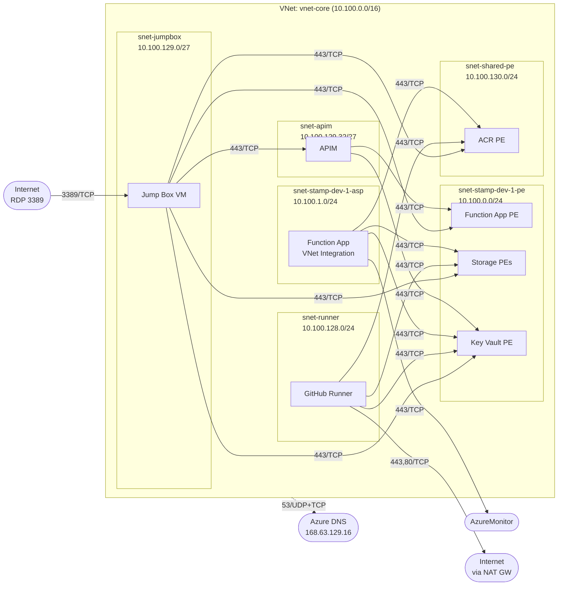

# Network Technical Design

Detailed network topology, subnet layout, NAT Gateway configuration, and per-subnet NSG rule design for the solution.

---

## 1. Design Principles

| Principle | Implementation |
|-----------|---------------|
| **Zero public internet exposure** | All PaaS services behind Private Endpoints. APIM in internal VNet mode. Function App `public_network_access_enabled = false`. |
| **Least-privilege NSG rules** | One NSG per subnet. Explicit deny-all as the final custom rule; allow only the minimum traffic each subnet requires. |
| **Deterministic egress** | NAT Gateway with a static Public IP attached to the runner subnet — the sole subnet whose NSG permits internet egress. All other subnets have `DenyAllOutbound` at NSG level. |
| **Private DNS resolution** | Azure Private DNS Zones linked to the VNet. All subnets resolve private endpoint FQDNs via Azure DNS (`168.63.129.16`). |
| **Private Endpoint Network Policies** | Enabled on PE subnets (`private_endpoint_network_policies = "Enabled"`) so that NSG rules apply to Private Endpoint traffic. |

---

## 2. VNet Design

A single shared VNet hosts all environments. Core infrastructure (ACR, DNS, NAT GW, jump box, runner) and all stamp subnets from every environment coexist in this VNet. Subnets for different environments are distinguished by including the environment name in the subnet name (e.g. `snet-stamp-dev-1-pe` vs `snet-stamp-prod-1-pe`).

| Attribute | Value |
|-----------|-------|
| **Name** | `vnet-core` |
| **Address Space** | `10.100.0.0/16` (65,536 IPs) |
| **Region** | Single region (parameterised) |
| **Resource Group** | `rg-core` |

The `/16` provides ample room for many stamps across all environments:
- Fixed shared subnets: `10.100.128.0+` range
- Stamp subnets: lower range, allocated sequentially across all environments

This design avoids per-environment VNet management overhead and allows future VNet peering of the single core VNet into a hub.

---

## 3. Subnet Layout

Subnets are divided into **fixed** (one per VNet, created by `modules/vnet`) and **per-stamp** (one pair per stamp per environment, created by `modules/workload-stamp-subnet`). Each subnet has a dedicated NSG.

### Fixed Subnets (4 — always present in `vnet-core`)

| Subnet Name | CIDR | Usable IPs | Delegation | Purpose | NAT Gateway |
|-------------|------|------------|------------|---------|-------------|
| `snet-runner` | `10.100.128.0/24` | 251 | None | Self-hosted GitHub Actions runner VM (`vm-runner-core`) | **Yes** |
| `snet-jumpbox` | `10.100.129.0/27` | 27 | None | Windows 11 jump box for developer connectivity and diagnostics | No |
| `snet-apim` | `10.100.129.32/27` | 27 | `Microsoft.ApiManagement/service` | API Management (internal VNet mode, Developer tier) | No |
| `snet-shared-pe` | `10.100.130.0/24` | 251 | None | Private Endpoints for shared resources (ACR PE only) | No |

### Per-Stamp Subnets (2 per stamp per environment — dynamic)

Stamp subnets occupy the lower address range of `10.100.0.0/16`. Subnet names include the environment to allow subnets for all environments to coexist in the single shared VNet. CIDRs are allocated sequentially in `phase1/core/terraform.tfvars`.

| Subnet Name Pattern | Delegation | Purpose | NSG Network Policies |
|---------------------|------------|---------|---------------------|
| `snet-stamp-<env>-<N>-pe` | None | Private Endpoints: Function App PE, Storage PEs (blob/file/table/queue), Key Vault PE | `Enabled` |
| `snet-stamp-<env>-<N>-asp` | `Microsoft.Web/serverFarms` | App Service Plan VNet integration (Function App outbound egress) | Default |

**Current stamp subnet allocations (from `terraform.tfvars`):**

| Environment | Stamp | PE Subnet | ASP Subnet |
|-------------|-------|-----------|------------|
| dev | 1 | `10.100.0.0/24` | `10.100.1.0/24` |
| dev | 2 | `10.100.2.0/24` | `10.100.3.0/24` |
| test | 1 | `10.100.4.0/24` | `10.100.5.0/24` |
| prod | 1 | `10.100.6.0/24` | `10.100.7.0/24` |

### Subnet Configuration Notes

- **PE subnets** (`snet-stamp-<N>-pe`, `snet-shared-pe`): `private_endpoint_network_policies = "Enabled"` to allow NSG enforcement on Private Endpoint NICs.
- **ASP subnets** (`snet-stamp-<N>-asp`): Delegation to `Microsoft.Web/serverFarms` is mandatory for App Service VNet integration. Function App **outbound** traffic originates from this subnet; **inbound** traffic arrives at the Function App's Private Endpoint in the stamp PE subnet.
- **APIM subnet** (`snet-apim`): Delegation to `Microsoft.ApiManagement/service` is mandatory. `/27` is the recommended minimum for Developer tier.
- **Runner subnet** (`snet-runner`): No delegation. Hosts `vm-runner-core`, the self-hosted GitHub Actions runner VM. Entra ID SSH login via `AADSSHLoginForLinux` extension; inbound SSH is permitted from `snet-jumpbox` only. The runner agent is registered with GitHub manually after VM provisioning.
- **Jump box subnet** (`snet-jumpbox`): No delegation. Hosts a single Windows 11 VM with a public IP for RDP access. Entra ID authentication via the `AADLoginForWindows` VM extension. `/27` is sufficient — only one VM is expected.

---

## 4. NAT Gateway

The self-hosted runner VM (`vm-runner-core`) is the **only** component that requires egress to the public internet (for GitHub Actions communication, package downloads, Azure Resource Manager API calls via Terraform, and `az acr login`). All other subnets have internet-bound outbound traffic denied at the NSG level.

| Attribute | Value |
|-----------|-------|
| **Name** | `nat-core` |
| **Public IP** | `pip-nat-core` (static Standard SKU) |
| **Associated Subnet** | `snet-runner` only |
| **Idle Timeout** | 4 minutes (default) |

### Why Only the Runner Subnet?

| Subnet | Internet Egress Required? | Reason |
|--------|--------------------------|--------|
| `snet-stamp-1-pe` | No | Private Endpoints are inbound-only listeners; they do not initiate connections. |
| `snet-stamp-1-asp` | No | Function App communicates exclusively with Private Endpoints (Storage, ACR, Key Vault) and Azure Monitor via service tag. No internet dependency. |
| `snet-apim` | No | APIM internal mode. Required outbound dependencies (Storage, SQL, Key Vault, Event Hub, Azure Monitor) are reached via Azure service tags, not internet routes. |
| `snet-shared-pe` | No | Private Endpoints are inbound-only listeners. |
| `snet-runner` | **Yes** | GitHub Actions runner agent polling, pulling packages (pip/apt), Azure ARM API (Terraform), Docker build and push to ACR. |
| `snet-jumpbox` | No | Jump box connects to internal resources only. Inbound RDP from internet; outbound to PE subnets within the VNet. No general internet egress required. |

---

## 5. Traffic Flow Summary

Defines the legitimate traffic paths between subnets and external endpoints. All other traffic is denied.



### Flow Matrix

| # | Source | Destination | Port | Protocol | Path | Purpose |
|---|--------|-------------|------|----------|------|---------|
| 1 | `snet-apim` (`10.100.129.32/27`) | `snet-stamp-<env>-<N>-pe` | 443 | TCP | VNet-internal | APIM → Function App PE (backend API call) |
| 2 | `snet-apim` | `snet-stamp-<env>-<N>-pe` | 443 | TCP | VNet-internal | APIM → Key Vault PE (mTLS certificate retrieval). KV PE is in stamp PE subnet; same rule covers both. |
| 3 | `snet-stamp-<env>-<N>-asp` | `snet-stamp-<env>-<N>-pe` | 443 | TCP | VNet-internal | Function App → Storage Account PEs (blob, file, table, queue) and KV PE |
| 4 | `snet-stamp-<env>-<N>-asp` | `snet-shared-pe` (`10.100.130.0/24`) | 443 | TCP | VNet-internal | Function App → ACR PE (image pull) |
| 5 | `snet-stamp-<env>-<N>-asp` | AzureMonitor | 443 | TCP | Service tag | Function App → App Insights telemetry + diagnostics |
| 6 | `snet-runner` (`10.100.128.0/24`) | `snet-shared-pe` | 443 | TCP | VNet-internal | Runner → ACR PE (image push) |
| 7 | `snet-runner` | `snet-stamp-<env>-<N>-pe` | 443 | TCP | VNet-internal | Runner → Storage PEs + KV PE (Phase 3: Terraform data-plane + cert/secret writes) |
| 8 | `snet-runner` | Internet | 443, 80 | TCP | NAT Gateway | Runner → GitHub API, package repos, Azure ARM API |
| 9 | All subnets | `168.63.129.16` | 53 | TCP/UDP | Azure platform | DNS resolution (Private DNS Zones + public forwarding) |
| 10 | Internet | `snet-jumpbox` (`10.100.129.0/27`) | 3389 | TCP | Public IP | RDP access to jump box (Entra ID authenticated) |
| 11 | `snet-jumpbox` | `snet-stamp-<env>-<N>-pe` | 443 | TCP | VNet-internal | Jump box → Function App PE, Storage PEs, KV PE (diagnostics) |
| 12 | `snet-jumpbox` | `snet-shared-pe` | 443 | TCP | VNet-internal | Jump box → ACR PE (diagnostics) |
| 13 | `snet-jumpbox` | `snet-apim` (`10.100.129.32/27`) | 443 | TCP | VNet-internal | Jump box → APIM gateway (API testing with mTLS client cert) |

---

## 6. NSG Design — Per-Subnet Rules

Each subnet has a dedicated NSG. Custom rules are numbered 100–4096 (4000 used for explicit deny-all). A `DenyAll` rule at priority 4000 catches any traffic not explicitly permitted. Azure default rules (65000+) exist but are superseded by the explicit deny.

> **Convention:** Rule names use kebab-case (`allow-inbound-apim`, `deny-all-outbound`). Service tag names follow Azure conventions (e.g., `AzureMonitor`, `ApiManagement`, `Storage`).

> **NSG management split:** Fixed-subnet NSG rules are defined in `phase1/core/network.tf`. Per-stamp NSG rules (and cross-cutting rules on the shared NSGs that target stamp CIDRs) are generated by the `modules/workload-stamp-subnet` module — called once per stamp via `for_each` in `phase1/core/network.tf`. Priority offsets (`stamp_index × 1`) avoid rule collisions when multiple stamps exist.

NSG names are derived from the VNet name:
- Fixed subnets: `nsg-core-<subnet-minus-snet-prefix>` — e.g. `nsg-core-apim`, `nsg-core-shared-pe`
- Stamp subnets: `nsg-core-stamp-<env>-<N>-pe`, `nsg-core-stamp-<env>-<N>-asp`

(VNet name `vnet-core` → `nsg_name_prefix = "nsg-core"` via `replace("vnet-core", "vnet-", "nsg-")`)

---

### 6.1 NSG: `nsg-core-stamp-<env>-<N>-pe` *(one per stamp per environment)*

**Attached to:** `snet-stamp-<env>-<N>-pe`
**Hosted resources:** Function App Private Endpoint, Storage Account Private Endpoints (blob, file, table, queue), Key Vault Private Endpoint

*CIDRs below are for dev stamp 1 (`snet-stamp-dev-1-pe = 10.100.0.0/24`). Other stamps substitute their respective CIDRs from `var.stamp_subnets`.*

#### Inbound Rules

| Priority | Name | Source | Destination | Port | Protocol | Action | Justification |
|----------|------|--------|-------------|------|----------|--------|---------------|
| 100 | allow-inbound-apim | `var.subnet_cidrs.apim` | `*` | 443 | TCP | **Allow** | APIM calls the Function App via its Private Endpoint. **This is the only path to invoke the Function App.** |
| 110 | allow-inbound-asp | `stamp.subnet_asp_cidr` | `*` | 443 | TCP | **Allow** | Function App (VNet-integrated in its own ASP subnet) accesses its Storage Account PEs. |
| 120 | allow-inbound-runner | `var.subnet_cidrs.runner` | `*` | 443 | TCP | **Allow** | GitHub Runner performs Terraform data-plane operations on Storage (Phase 3). |
| 130 | allow-inbound-jumpbox | `var.subnet_cidrs.jumpbox` | `*` | 443 | TCP | **Allow** | Jump box → Function App PE, Storage PEs (diagnostics and validation). |
| 4096 | deny-all-outbound | `*` | `*` | `*` | `*` | **Deny** | Default deny — no other source may reach stamp Private Endpoints. |

#### Outbound Rules

| Priority | Name | Source | Destination | Port | Protocol | Action | Justification |
|----------|------|--------|-------------|------|----------|--------|---------------|
| 4096 | deny-all-outbound | `*` | `*` | `*` | `*` | **Deny** | Private Endpoints do not initiate outbound connections. NSG statefulness handles return traffic for allowed inbound flows. |

---

### 6.2 NSG: `nsg-core-stamp-<env>-<N>-asp` *(one per stamp per environment)*

**Attached to:** `snet-stamp-<env>-<N>-asp`
**Hosted resources:** App Service Plan VNet integration (Function App outbound traffic originates here)

> **Key point:** The Function App is **not** reachable via this subnet. All inbound requests to the Function App arrive at its Private Endpoint in `snet-stamp-<N>-pe`. This subnet carries only the Function App's *outbound* traffic.

#### Inbound Rules

| Priority | Name | Source | Destination | Port | Protocol | Action | Justification |
|----------|------|--------|-------------|------|----------|--------|---------------|
| 100 | AllowAzureLBProbes | `AzureLoadBalancer` | `10.155.1.0/24` | `*` | `*` | **Allow** | Azure infrastructure health probes for App Service Plan. |
| 4096 | DenyAllInbound | `*` | `*` | `*` | `*` | **Deny** | No application traffic enters via the VNet integration subnet. |

#### Outbound Rules

| Priority | Name | Source | Destination | Port | Protocol | Action | Justification |
|----------|------|--------|-------------|------|----------|--------|---------------|
| 100 | AllowToStampPE | `10.155.1.0/24` | `10.155.0.0/24` | 443 | TCP | **Allow** | Function App → Storage Account PEs (blob, file, table, queue). |
| 110 | AllowToSharedPE | `10.155.1.0/24` | `10.155.3.0/24` | 443 | TCP | **Allow** | Function App → ACR PE (container image pull), Key Vault PE (secret retrieval). |
| 120 | AllowToAzureMonitor | `10.155.1.0/24` | `AzureMonitor` | 443 | TCP | **Allow** | App Insights telemetry ingestion and diagnostic data. |
| 130 | AllowDNS | `10.155.1.0/24` | `168.63.129.16/32` | 53 | Any | **Allow** | Azure DNS resolution for Private DNS Zones. |
| 4096 | DenyAllOutbound | `*` | `*` | `*` | `*` | **Deny** | **No internet egress.** Function App has no legitimate need to reach the public internet. |

---

### 6.3 NSG: `nsg-core-apim`

**Attached to:** `snet-apim` (`10.100.129.32/27`)
**Hosted resources:** API Management (internal VNet mode, Developer tier)

APIM in internal VNet mode has **mandatory NSG requirements** documented by Microsoft. These rules are marked as **(Required)** below. Omitting them will cause APIM provisioning or runtime failures.

#### Inbound Rules

| Priority | Name | Source | Destination | Port | Protocol | Action | Justification |
|----------|------|--------|-------------|------|----------|--------|---------------|
| 100 | AllowVNetClientsToGateway | `VirtualNetwork` | `VirtualNetwork` | 443 | TCP | **Allow** | VNet clients → APIM gateway endpoint (mTLS-protected API calls). |
| 110 | AllowManagementPlane | `ApiManagement` | `VirtualNetwork` | 3443 | TCP | **Allow** | **(Required)** Azure management plane → APIM control plane. |
| 120 | AllowAzureLBHealth | `AzureLoadBalancer` | `10.100.129.32/27` | 65200-65535 | TCP | **Allow** | **(Required)** Azure infrastructure health probes for APIM. |
| 130 | AllowJumpboxToApim | `10.100.129.0/27` | `10.100.129.32/27` | 443 | TCP | **Allow** | Jump box → APIM gateway for API testing with mTLS client certificate. |
| 4096 | DenyAllInbound | `*` | `*` | `*` | `*` | **Deny** | No other source may reach APIM. |

#### Outbound Rules

| Priority | Name | Source | Destination | Port | Protocol | Action | Justification |
|----------|------|--------|-------------|------|----------|--------|---------------|
| 100 | AllowToStampPE | `*` | `<stamp-pe-cidr>` | 443 | TCP | **Allow** | APIM → Function App PE **and** Key Vault PE (both in stamp PE subnet). Rule generated per stamp by `workload-stamp-subnet` module with priority offset by stamp index. |
| 110 | AllowToSharedPE | `*` | `10.100.130.0/24` | 443 | TCP | **Allow** | APIM → ACR PE (shared-pe subnet). |
| 120 | AllowToStorage | `*` | `Storage` | 443 | TCP | **Allow** | **(Required)** APIM dependency on Azure Storage. |
| 130 | AllowToSQL | `*` | `Sql` | 1433 | TCP | **Allow** | **(Required)** APIM dependency on Azure SQL for configuration store. |
| 140 | AllowToEventHub | `*` | `EventHub` | 443 | TCP | **Allow** | **(Required)** APIM logging and diagnostics pipeline. |
| 150 | AllowToAzureMonitor | `*` | `AzureMonitor` | 443 | TCP | **Allow** | **(Required)** Metrics, diagnostics, and health telemetry. |
| 160 | AllowToAzureAD | `*` | `AzureActiveDirectory` | 443 | TCP | **Allow** | **(Required)** Azure AD authentication for APIM management and developer portal. |
| 170 | AllowToKeyVault | `*` | `AzureKeyVault` | 443 | TCP | **Allow** | **(Required)** APIM platform dependency on Key Vault. |
| 180 | AllowDNS | `*` | `*` | 53 | Any | **Allow** | Azure DNS resolution for Private DNS Zones and platform services. |
| 4096 | DenyAllOutbound | `*` | `*` | `*` | `*` | **Deny** | **No internet egress.** All required APIM dependencies are addressed via service tags above. |

---

### 6.4 NSG: `nsg-core-shared-pe`

**Attached to:** `snet-shared-pe` (`10.100.130.0/24`)
**Hosted resources:** ACR Private Endpoint

> **Note:** Key Vault has moved into each stamp's PE subnet (`snet-stamp-<env>-<N>-pe`). Only ACR remains in the shared PE subnet.

#### Inbound Rules

| Priority | Name | Source | Destination | Port | Protocol | Action | Justification |
|----------|------|--------|-------------|------|----------|--------|---------------|
| 100+ | AllowAspToSharedPE | `<stamp-asp-cidr>` | `*` | 443 | TCP | **Allow** | Function App → ACR PE (image pull). One rule per stamp, generated by `workload-stamp-subnet` module with priority offset. |
| 110 | AllowRunnerToSharedPE | `10.100.128.0/24` | `*` | 443 | TCP | **Allow** | GitHub Runner → ACR PE (image push via `az acr login`). |
| 120 | AllowApimToSharedPE | `10.100.129.32/27` | `*` | 443 | TCP | **Allow** | APIM → ACR PE. |
| 130 | AllowJumpboxToSharedPE | `10.100.129.0/27` | `*` | 443 | TCP | **Allow** | Jump box → ACR PE (image verification and diagnostics). |
| 4096 | DenyAllInbound | `*` | `*` | `*` | `*` | **Deny** | No other source may reach shared Private Endpoints. |

#### Outbound Rules

| Priority | Name | Source | Destination | Port | Protocol | Action | Justification |
|----------|------|--------|-------------|------|----------|--------|---------------|
| 4096 | DenyAllOutbound | `*` | `*` | `*` | `*` | **Deny** | Private Endpoints do not initiate outbound connections. |

---

### 6.5 NSG: `nsg-core-runner`

**Attached to:** `snet-runner` (`10.100.128.0/24`)
**Hosted resources:** `vm-runner-core` — Ubuntu 22.04 self-hosted GitHub Actions runner VM

The runner is the **only** resource with internet egress. It requires outbound connectivity for GitHub Actions agent polling, package installation, Azure Resource Manager API (Terraform), and Docker image builds and pushes.

#### Inbound Rules

| Priority | Name | Source | Destination | Port | Protocol | Action | Justification |
|----------|------|--------|-------------|------|----------|--------|---------------|
| 100 | AllowSSHFromJumpbox | `10.100.129.0/27` | `*` | 22 | TCP | **Allow** | SSH from jump box for runner VM management. Use `az ssh vm` with Entra ID credentials from the jump box. |
| 4096 | DenyAllInbound | `*` | `*` | `*` | `*` | **Deny** | All other inbound traffic denied. |

#### Outbound Rules

| Priority | Name | Source | Destination | Port | Protocol | Action | Justification |
|----------|------|--------|-------------|------|----------|--------|---------------|
| 110 | AllowToSharedPE | `*` | `10.100.130.0/24` | 443 | TCP | **Allow** | Runner → ACR PE (image push via `az acr login`). |
| 100+ | AllowToStampPE | `*` | `<stamp-pe-cidr>` | 443 | TCP | **Allow** | Runner → Storage Account PEs + KV PE (Phase 3: Terraform data-plane + cert/secret writes). Rule generated per stamp by `workload-stamp-subnet` module. |
| 120 | AllowToInternetHTTPS | `*` | `Internet` | 443 | TCP | **Allow** | Runner → Internet via NAT GW: GitHub API, Azure ARM API (Terraform), pip/apt repos, Docker Hub. |
| 130 | AllowToInternetHTTP | `*` | `Internet` | 80 | TCP | **Allow** | Runner → Internet via NAT GW: package repository metadata (some repos serve over HTTP). |
| 140 | AllowDNS | `*` | `*` | 53 | Any | **Allow** | Azure DNS resolution for both Private DNS Zones and public DNS forwarding. |
| 4096 | DenyAllOutbound | `*` | `*` | `*` | `*` | **Deny** | Deny all other outbound (e.g., SSH, non-standard ports). |

---

### 6.6 NSG: `nsg-core-jumpbox`

**Attached to:** `snet-jumpbox` (`10.100.129.0/27`)
**Hosted resources:** Windows 11 jump box VM (Entra ID–authenticated, `AADLoginForWindows` extension)

The jump box provides developer/operator connectivity into the VNet for diagnostics, API testing, and troubleshooting. It is the only resource with a public IP and inbound internet access.

#### Inbound Rules

| Priority | Name | Source | Destination | Port | Protocol | Action | Justification |
|----------|------|--------|-------------|------|----------|--------|---------------|
| 100 | AllowRDPFromInternet | `Internet` | `*` | 3389 | TCP | **Allow** | RDP access to jump box. Authentication enforced via Entra ID — no local passwords. In production, replace with Azure Bastion. |
| 4096 | DenyAllInbound | `*` | `*` | `*` | `*` | **Deny** | No other inbound traffic permitted. |

#### Outbound Rules

| Priority | Name | Source | Destination | Port | Protocol | Action | Justification |
|----------|------|--------|-------------|------|----------|--------|---------------|
| 100+ | AllowToStampPE | `*` | `<stamp-pe-cidr>` | 443 | TCP | **Allow** | Jump box → Function App PE, Storage PEs, Key Vault PE (diagnostics). Rule generated per stamp by `workload-stamp-subnet` module. |
| 110 | AllowToSharedPE | `*` | `10.100.130.0/24` | 443 | TCP | **Allow** | Jump box → ACR PE (image verification). |
| 120 | AllowToApim | `*` | `10.100.129.32/27` | 443 | TCP | **Allow** | Jump box → APIM gateway (API testing with mTLS client certificate). |
| 130 | AllowToAzureAD | `*` | `AzureActiveDirectory` | 443 | TCP | **Allow** | Entra ID authentication for the AADLoginForWindows extension and user sign-in. |
| 140 | AllowDNS | `*` | `*` | 53 | Any | **Allow** | Azure DNS resolution for Private DNS Zones. |
| 4096 | DenyAllOutbound | `*` | `*` | `*` | `*` | **Deny** | **No internet egress.** The jump box is for internal diagnostics only, not general browsing. |

---

## 7. NSG Design Rationale — Key Constraints Enforced

The following table maps the user's stated network constraints to the specific NSG rules that enforce them.

| Constraint | How Enforced |
|------------|-------------|
| **Only the self-hosted runner gets internet egress** | NAT Gateway attached to `snet-runner`. All other subnets have `DenyAllOutbound` at priority 4096 with no preceding internet-bound allow rules. The runner NSG has explicit `AllowToInternetHTTPS` (120) and `AllowToInternetHTTP` (130). |
| **Function App callable only via APIM** | `snet-stamp-1-pe` inbound rule 100 allows only `10.100.129.32/27` (APIM subnet) on port 443 to reach the Function App PE. No other subnet has a rule permitting traffic to the Function App PE. The ASP and runner rules against `snet-stamp-1-pe` target Storage PEs, not the Function App PE — but since NSGs operate at subnet level, this is a pragmatic trade-off documented in section 8. |
| **ACR reachable from both Runner and Function App** | `snet-shared-pe` inbound rules 100 and 110 allow traffic from `snet-stamp-1-asp` (Function App) and `snet-runner` (self-hosted runner) respectively. Corresponding outbound rules on those source subnets permit egress to `10.100.130.0/24`. |
| **Key Vault reachable from Function App, APIM, and Runner** | Key Vault is per-stamp in `snet-stamp-<N>-pe`. The existing `snet-stamp-1-pe` inbound rules (110 for ASP, 100 for APIM, 120 for runner, 130 for jumpbox) already cover this — no additional rules needed. KV PE shares the subnet with Function App and Storage PEs. |
| **Jump box can reach all internal resources** | `snet-jumpbox` outbound rules 100–120 allow HTTPS to stamp PE (covering KV, Function App, Storage PEs), shared PE (ACR), and APIM subnets. Corresponding inbound rules on `snet-stamp-1-pe` (130), `snet-shared-pe` (120), and `snet-apim` allow traffic from `10.100.129.0/27`. Jump box has **no internet egress** — only inbound RDP and outbound to VNet resources. |

---

## 8. Design Notes & Trade-offs

### NSG Granularity vs. Subnet-Level Enforcement

Azure NSGs operate at the **subnet level**, not the individual Private Endpoint level. This means that an allow rule permitting `snet-stamp-1-asp → snet-stamp-1-pe:443` grants access to **all** PEs in `snet-stamp-1-pe` (Function App PE + Storage PEs), not just the Storage PEs. Similarly, `snet-runner → snet-stamp-1-pe:443` grants access to both Storage PEs and the Function App PE.

To enforce truly granular PE-level isolation (e.g., preventing the runner from reaching the Function App PE), you have two options:

1. **Separate subnets** — place the Function App PE and Storage PEs in different subnets, each with its own NSG. This increases subnet count but enables precise control.
2. **Application Security Groups (ASGs)** — assign ASGs to individual PE NICs and reference them in NSG rules. This avoids subnet proliferation.

For this design, the pragmatic decision is to **accept subnet-level granularity**. The runner and ASP subnets have no legitimate reason to call the Function App directly (only APIM does), and the Function App's `public_network_access_enabled = false` combined with its authentication model provides defence-in-depth beyond NSG rules alone. If stricter isolation is needed later, ASGs can be retrofitted without re-architecting the subnet layout.

### APIM Mandatory NSG Rules

APIM in internal VNet mode requires specific outbound connectivity to Azure platform services (Storage, SQL, Key Vault, Event Hub, Azure Monitor, Azure AD). These are handled via **service tags**, not internet egress. The APIM subnet's `DenyAllOutbound` rule at priority 4096 does **not** block these flows because the service tag rules at lower priority numbers (higher priority) match first.

### Private Endpoint Network Policies

NSG enforcement on Private Endpoints requires `private_endpoint_network_policies = "Enabled"` on the subnet. This is a subnet-level property set in Terraform via `azurerm_subnet`. Without this, NSG rules on PE subnets are **silently ignored** — a common misconfiguration.

### DNS Resolution

All subnets include an outbound allow rule to `168.63.129.16:53` (Azure DNS). This is the Azure platform DNS resolver that:
- Resolves Private DNS Zone records (e.g., `*.privatelink.azurecr.io` → PE private IP)
- Forwards non-private queries to public DNS (used by the runner for external name resolution)

Without this rule, private endpoint FQDN resolution fails and all private connectivity breaks.

### APIM Managed Identity — Key Vault Access

The traffic flow (row 2 in the flow matrix) shows APIM reaching the Key Vault Private Endpoint to retrieve the mTLS CA certificate. Key Vault is now per-stamp (in `snet-stamp-<N>-pe`), so APIM accesses each stamp's KV via the existing allow rule that permits traffic from `snet-apim` to `snet-stamp-<N>-pe`. NSG rules permit this traffic, but APIM also requires an **authorisation grant** to read from each stamp's Key Vault.

APIM should have a system-assigned Managed Identity enabled. That identity needs at minimum the **Key Vault Certificate User** and **Key Vault Secrets User** roles on each stamp's Key Vault (RBAC authorisation mode is used). Without these role assignments, APIM can reach the Key Vault Private Endpoint at the network level but the request will be rejected with a 403.

These role assignments are provisioned in `modules/workload-stamp/identity.tf` alongside the other stamp-level role assignments, using `var.apim_principal_id`.

---

### NSG Flow Logs

All NSGs should have flow logs enabled and streaming to the Log Analytics Workspace. This provides:
- Audit trail of all allowed and denied flows
- Troubleshooting data for connectivity issues during deployment
- Input for Network Watcher Traffic Analytics

This is configured in the `modules/vnet` module when a Log Analytics Workspace ID is supplied.

---

## 9. Resource Naming Summary

NSG names are derived from the VNet name via `replace(vnet_name, "vnet-", "nsg-")`:
- Fixed subnets (from `modules/vnet`): `nsg-core-<subnet-minus-snet-prefix>`
- Stamp subnets (from `modules/workload-stamp-subnet`): `nsg-core-stamp-<env>-<N>-<pe|asp>`

| Resource | Name | Example |
|----------|------|---------|
| Core Resource Group | `rg-core` | `rg-core` |
| VNet | `vnet-core` | `vnet-core` |
| ACR | `acrcore` | `acrcore` |
| Log Analytics Workspace | `law-core` | `law-core` |
| Diagnostic Storage | `stdiagcore` | `stdiagcore` |
| Subnet (fixed) | `snet-<scope>` | `snet-apim`, `snet-runner` |
| Subnet (stamp) | `snet-stamp-<env>-<N>-<pe\|asp>` | `snet-stamp-dev-1-pe`, `snet-stamp-dev-1-asp` |
| NSG (fixed) | `nsg-core-<scope>` | `nsg-core-apim`, `nsg-core-runner` |
| NSG (stamp) | `nsg-core-stamp-<env>-<N>-<pe\|asp>` | `nsg-core-stamp-dev-1-pe` |
| NAT Gateway | `nat-core` | `nat-core` |
| Public IP (NAT GW) | `pip-nat-core` | `pip-nat-core` |
| Jump Box VM | `vm-jumpbox-core` | `vm-jumpbox-core` |
| Jump Box NIC | `nic-jumpbox-core` | `nic-jumpbox-core` |
| Jump Box Public IP | `pip-jumpbox-core` | `pip-jumpbox-core` |
| Runner VM | `vm-runner-core` | `vm-runner-core` |
| Runner NIC | `nic-runner-core` | `nic-runner-core` |

---

## 10. Terraform Implementation Notes

### VNet Module Integration

The `modules/vnet` module accepts a list of subnet objects. Stamp subnets are generated dynamically by the root config using `concat()` over `flatten([ for stamp_key, stamp in var.stamps : [...] ])` and the fixed subnet list. The NAT Gateway ID is passed into the `snet-runner` subnet definition.

### Multi-Stamp NSG Rules

Per-stamp NSG rules (`for_each = var.stamps`) are defined in the root config `network.tf`. Cross-cutting rules on shared NSGs (APIM, shared-PE, runner, jumpbox) that target stamp PE/ASP subnets use the same `for_each` pattern, with priorities offset by `local.stamp_index[each.key]` to prevent collisions. Adding a new stamp in a `.tfvars` file automatically generates all required NSG rules.

### NSG Rules in the Root Config

NSG rules are defined as separate `azurerm_network_security_rule` resources (not inline in the module) so they can reference cross-cutting locals (subnet CIDRs, `for_each` over stamps) and module outputs.

### Private Endpoint Network Policies

Ensure all PE subnets set this property:

```hcl
private_endpoint_network_policies = "Enabled"
```

This is set on the `azurerm_subnet` resource within the VNet module.
