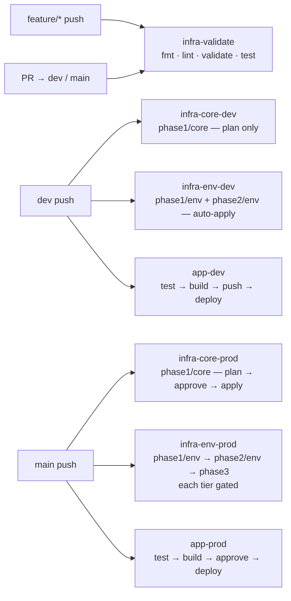
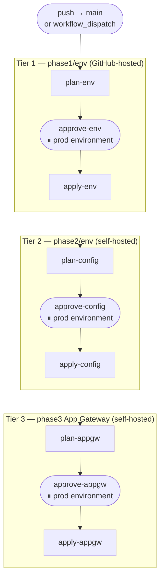

# CI/CD Approach

Four path-scoped workflows — core infrastructure, environment infrastructure, and application code — sharing the same branch model and approval gate. A fifth workflow validates all Terraform roots on every PR and feature-branch push.

---

## 1. Branch → Environment Model

Terraform workspaces are the source of truth for environments. Branches map to workspaces:

| Branch | Terraform workspace | Image tag | Stamps targeted |
|--------|---------------------|-----------|-----------------|
| `dev`  | `dev`               | `:dev`    | dev stamps      |
| `main` | `prod`              | `:latest` | prod stamps     |

Development happens on short-lived feature branches. A feature PR merges to `dev` first (integration, auto-deploy), then a promotion PR merges `dev` into `main` (prod, gated).

```
feature/xyz ──PR──► dev ──PR──► main
                     │             │
                  workspace:dev  workspace:prod
                  auto-deploy    gated deploy
```

### Workflow trigger map



---

## 2. Runner Requirements

Two runner types are used. GitHub-hosted runners handle everything that only needs the Azure ARM API (Terraform control plane, tests, linting). The self-hosted runner — a small Ubuntu VM (`vm-runner-core`) in `snet-runner` inside `vnet-core` — is required for any job that needs to reach private data-plane endpoints.

| Job | Runner | Why |
|-----|--------|-----|
| Lint / validate / test | GitHub-hosted (`ubuntu-latest`) | No Azure network access needed |
| `phase1/core` plan + apply | GitHub-hosted | Terraform ARM API only |
| `phase1/env` plan + apply | GitHub-hosted | Terraform ARM API only; KV data plane not accessed |
| `phase2/env` plan + apply | **Self-hosted** (`[self-hosted, linux]`) | Must reach private KV and APIM endpoints inside VNet |
| `phase3` plan + apply | **Self-hosted** | Must reach private KV endpoint for App Gateway cert provisioning |
| Docker build + push to ACR | **Self-hosted** | ACR has `public_network_access_enabled = false` |
| Webhook deploy | **Self-hosted** | Kudu SCM endpoint only reachable from inside VNet |

The runner VM is registered with GitHub automatically during provisioning via a Custom Script Extension that runs `setup-runner.sh`. The script installs Docker, Azure CLI, Node.js, and the GitHub Actions runner binary, then registers and starts the runner as a systemd service using a PAT-based registration token. It uses the label set `self-hosted,linux` by convention.

---

## Pipeline 1: Core Infrastructure (`infra-core-*`)

_Triggered on changes to `terraform/phase1/core/`, `terraform/modules/`, or `scripts/setup-runner.sh`_

Core infrastructure (VNet, ACR, Log Analytics, NAT Gateway, Jump Box, self-hosted runner VM) is deployed once — no workspace, no dev/prod split. Changes are infrequent and high-impact. A plan runs on `dev` merges so the effect is visible before reaching `main`; the apply is always gated.

### Merge to `dev` — Plan only (`infra-core-dev`)

Produces a plan against live core state. No apply — core has no dev workspace and is never auto-deployed.

```
Merge to dev
  → (GitHub-hosted)
    → terraform -chdir=phase1/core plan
    → Plan summary posted to Actions job summary
```

### Merge to `main` — Plan → Approve → Apply (`infra-core-prod`)

```
Merge to main
  │
  ├── PLAN (GitHub-hosted)
  │     → terraform -chdir=phase1/core plan -out=/tmp/tfplan-core
  │     → az storage blob upload --container-name tfplans --name "core-${RUN_ID}.tfplan"
  │
  ├── APPROVAL (prod environment)
  │     → Workflow pauses — reviewer inspects plan summary
  │     → Approves or rejects
  │
  └── APPLY (GitHub-hosted)
        → az storage blob download "core-${RUN_ID}.tfplan"
        → terraform -chdir=phase1/core apply /tmp/tfplan-core
```

---

## Pipeline 2: Environment Infrastructure (`infra-env-*`)

_Triggered on changes to `terraform/phase1/env/`, `terraform/phase2/`, `terraform/phase3/`, or `terraform/modules/`_

Three sequentially dependent Terraform roots, each scoped to a different layer of the stack:

| Layer | Root | What it owns | Workspace-driven? |
|-------|------|--------------|-------------------|
| env | `phase1/env` | APIM, Function App, Key Vault, subnets | Yes (`dev` / `prod`) |
| config | `phase2/env` | APIM APIs, policies, secrets, alert rules | Yes (`dev` / `prod`) |
| appgw | `phase3` | Shared Application Gateway (mTLS public ingress) | No — single shared deployment |

`phase2/env` reads `phase1/env` remote state, so it cannot run until `phase1/env` apply completes. `phase3` reads remote state from both `phase1/core` and both `phase1/env` workspaces (`dev` + `prod`) simultaneously, so it only ever runs from `main` and is not deployed on `dev` pushes.

### Merge to `dev` — Auto-apply (`infra-env-dev`)

Low-friction: plan and apply happen automatically. Phase3 (App Gateway) is skipped — it is shared infrastructure and must not be re-deployed from a branch that only represents one environment.

```
Merge to dev
  ├── phase1/env (GitHub-hosted)
  │     → terraform workspace select dev
  │     → terraform plan -var-file=terraform.tfvars -var-file=dev.tfvars -out=tfplan
  │     → terraform apply tfplan
  │
  └── phase2/env (self-hosted — runs after phase1/env apply)
        → terraform workspace select dev
        → terraform plan -var-file=terraform.tfvars -var-file=dev.tfvars -out=tfplan
        → terraform apply tfplan
```

### Merge to `main` — Three gated tiers (`infra-env-prod`)

Each tier produces a plan, pauses for approval, then applies the exact reviewed plan (retrieved from blob storage). The diagram below shows the full 9-job chain:



Plan files are uploaded to the `tfplans` container of the state storage account keyed by `GITHUB_RUN_ID` so each run's apply uses the exact binary that was reviewed. Blobs older than 30 days are cleaned up by a retention policy.

```
Merge to main
  │
  ├── PLAN ENV (GitHub-hosted)
  │     → terraform workspace select prod
  │     → terraform -chdir=phase1/env plan -var-file=terraform.tfvars -var-file=prod.tfvars \
  │           -out=/tmp/tfplan-env-prod
  │     → az storage blob upload --name "env-prod-${RUN_ID}.tfplan"
  │
  ├── APPROVAL — ENV (prod environment)
  │
  ├── APPLY ENV (GitHub-hosted)
  │     → az storage blob download "env-prod-${RUN_ID}.tfplan"
  │     → terraform -chdir=phase1/env apply /tmp/tfplan-env-prod
  │
  ├── PLAN CONFIG (self-hosted — needs VNet access to KV and APIM)
  │     → terraform workspace select prod
  │     → terraform -chdir=phase2/env plan -var-file=terraform.tfvars -var-file=prod.tfvars \
  │           -out=/tmp/tfplan-config-prod
  │     → az storage blob upload --name "config-prod-${RUN_ID}.tfplan"
  │
  ├── APPROVAL — CONFIG (prod environment)
  │
  ├── APPLY CONFIG (self-hosted)
  │     → az storage blob download "config-prod-${RUN_ID}.tfplan"
  │     → terraform -chdir=phase2/env apply /tmp/tfplan-config-prod
  │
  ├── PLAN APPGW (self-hosted — needs VNet access to KV for cert provisioning)
  │     → terraform -chdir=phase3 plan -var-file=terraform.tfvars \
  │           -out=/tmp/tfplan-appgw
  │     → az storage blob upload --name "appgw-prod-${RUN_ID}.tfplan"
  │
  ├── APPROVAL — APPGW (prod environment)
  │
  └── APPLY APPGW (self-hosted)
        → az storage blob download "appgw-prod-${RUN_ID}.tfplan"
        → terraform -chdir=phase3 apply /tmp/tfplan-appgw
```

The approval gate is a [GitHub Actions environment](https://docs.github.com/en/actions/deployment/targeting-different-environments/using-environments-for-deployment) named `prod` with required reviewers configured. The same environment is reused by all three tiers and by the application pipeline.

The `infra-env-prod` workflow also has a `workflow_dispatch` trigger so phase3 can be redeployed independently without a code change (e.g., after rotating the App Gateway certificate).

---

## Pipeline 3: Application Code (`app-*`)

_Triggered on changes to `function_app/` and app workflow files_

### Feature Branch — Test & Build (`app-pr`)

Catches failures on every branch before anything reaches dev or prod.

```
Pull request to dev or main
  ├── (GitHub-hosted) Test
  │     → pip install -r requirements.txt
  │     → pytest tests/ -v --cov
  │     → (fail if coverage < 90%)
  │
  └── (self-hosted) Build
        → docker build -t wkld-api:ci .
        → (image discarded — push step not run)
```

The Docker build runs on the self-hosted runner because it will need ACR access in the push step; using the same runner for both avoids environment differences between validate and real builds.

### Merge to `dev` — Test, Build, Push, Deploy (`app-dev`)

```
Merge to dev
  → (GitHub-hosted) Test
      → pytest tests/ --cov ... (fail fast)

  → (self-hosted) Build + push + deploy
      → az acr login --name acrcore
      → docker build -t acrcore.azurecr.io/wkld-api:dev .
      → docker push acrcore.azurecr.io/wkld-api:dev
      → for each stamp (1, 2):
          WEBHOOK=$(az keyvault secret show \
                --vault-name kv-wkld-<N>-dev \
                --name deploy-webhook-url \
                --query value -o tsv)
          curl -s -X POST "$WEBHOOK"
```

### Merge to `main` — Test, Build, Push, Approve, Deploy (`app-prod`)

The image is pushed to ACR before the approval gate so the reviewer can inspect it (`az acr repository show-tags`) as part of the approval decision. The deploy step is then fast — no build time after approval. If approval is rejected, the image sits in ACR unused; the running prod environment is unaffected (the Function App only pulls when the webhook fires).

```
Merge to main
  │
  ├── (GitHub-hosted) Test
  │     → pytest tests/ --cov ... (fail fast)
  │
  ├── (self-hosted) Build + push
  │     → az acr login --name acrcore
  │     → docker build -t acrcore.azurecr.io/wkld-api:latest .
  │     → docker push acrcore.azurecr.io/wkld-api:latest
  │
  ├── APPROVAL (prod environment — same gate as infra)
  │     → Workflow pauses
  │     → Reviewer confirms image is ready to deploy
  │     → Approves or rejects
  │
  └── (self-hosted) Deploy
        → for each prod stamp (1):
            WEBHOOK=$(az keyvault secret show \
                  --vault-name kv-wkld-<N>-prod \
                  --name deploy-webhook-url \
                  --query value -o tsv)
            curl -s -X POST "$WEBHOOK"
```

### Webhook Mechanism

The Kudu container deployment webhook (`/api/registry/webhook`) instructs the Function App platform to pull the latest image digest behind the configured tag and restart atomically. It is used instead of `az functionapp restart` (which does not force a pull) and instead of ACR native webhooks (which originate from the public internet and cannot reach the private SCM endpoint).

The webhook URL embeds publishing credentials and is stored as `deploy-webhook-url` in each stamp's Key Vault. It is written there by `phase2/env` Terraform (self-hosted runner), which is the only runner that can reach the private KV data plane.

---

## 3. Promotion Flow — Dev to Prod

```
feature/xyz
    │
    ▼  PR review + merge
   dev ─────────────────────────── auto-deploy → dev stamps
    │
    ▼  PR review + merge (promotion PR: dev → main)
  main ────── plan → approve (×3) ── apply infra → prod stamps
         └─── test → build ───────── approve → deploy → prod stamps
```

Promotion to prod is a deliberate act — a PR from `dev` to `main`, reviewed and merged by a team member, triggering the gated pipelines. There is no automatic promotion.
