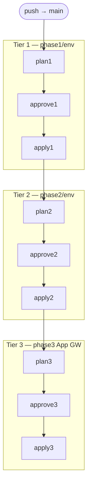

# CI/CD Approach

Path-scoped GitHub Actions workflows covering infrastructure validation, deployment across three Terraform phases, and application build/deploy.

---

## 1. Branch → Environment Model

| Branch | Terraform workspace | Image tag | Deploy mode |
|--------|---------------------|-----------|-------------|
| `dev` | `dev` | `:dev` | Auto-deploy |
| `main` | `prod` | `:latest` | Gated (approval required) |

Feature branches → PR to `dev` (integration) → PR to `main` (promotion, gated).

```
feature/xyz ──PR──► dev ──PR──► main
                     │             │
                  auto-deploy    gated deploy
```

---

## 2. Runner Requirements

| Job type | Runner | Why |
|----------|--------|-----|
| Lint / validate / test | GitHub-hosted | No Azure network access needed |
| Phase 1 (core + env) plan/apply | GitHub-hosted | Terraform ARM API only |
| Phase 2 (config, secrets, alerts) | **Self-hosted** | Must reach private KV and APIM endpoints inside VNet |
| Phase 3 (App GW) | **Self-hosted** | Must reach private KV endpoint for cert provisioning |
| Docker build + ACR push | **Self-hosted** | ACR has no public access |
| Webhook deploy | **Self-hosted** | Kudu endpoint only reachable from VNet |

The self-hosted runner (`vm-runner-core`) is registered automatically during provisioning via Custom Script Extension (`setup-runner.sh`). It installs Docker, Azure CLI, Node.js, and the GitHub Actions runner binary, then registers with the `self-hosted,linux` label set.

---

## 3. Validation Pipeline

Runs on every PR and feature branch push. GitHub-hosted runner.

- `terraform fmt -check -recursive`
- `terraform validate` on all roots
- `terraform test` on all four modules (mock providers, no Azure creds needed)

---

## 4. Core Infrastructure Pipeline

_Triggered on changes to `terraform/phase1/core/`, `terraform/modules/`, or `scripts/setup-runner.sh`._

Core infra (VNet, ACR, LAW, VMs) is deployed once — no workspace, no dev/prod split.

- **Merge to `dev`** — plan only (no apply; core has no dev workspace)
- **Merge to `main`** — plan → approval gate → apply. Plan stored to blob storage for exact reviewed apply.

---

## 5. Environment Infrastructure Pipeline

_Triggered on changes to `terraform/phase1/env/`, `terraform/phase2/`, `terraform/phase3/`, or `terraform/modules/`._

Three sequentially dependent Terraform roots:

| Tier | Root | Runner | What it owns |
|------|------|--------|-------------|
| 1 | `phase1/env` | GitHub-hosted | APIM, Function App, KV, stamps |
| 2 | `phase2/env` | Self-hosted | APIM config, secrets, alerts |
| 3 | `phase3` | Self-hosted | Application Gateway (shared, not workspace-driven) |

Each tier reads remote state from the one before, so they must run sequentially.

### Merge to `dev` — auto-apply (phases 1 + 2 only)

Phase 3 (App GW) is skipped on dev — it's shared infrastructure that reads both env workspaces and should only deploy from `main`.

```
dev push → phase1/env plan+apply (GitHub-hosted)
         → phase2/env plan+apply (self-hosted, after phase1)
```

### Merge to `main` — three gated tiers

Each tier: plan → approval → apply. Plan files stored to blob storage keyed by `GITHUB_RUN_ID`.



The approval gate is a GitHub Actions environment (`prod`) with required reviewers. The workflow also supports `workflow_dispatch` for independent re-deployment.

---

## 6. Application Pipeline

_Triggered on changes to `function_app/` and app workflow files._

### Feature branch — test + trial build

```
PR → dev or main
  ├── (GitHub-hosted) pytest --cov (fail if < 90%)
  └── (self-hosted) docker build (image discarded — no push)
```

### Merge to `dev` — test, build, push, deploy

```
dev push
  → pytest (GitHub-hosted, fail fast)
  → docker build + push :dev tag (self-hosted)
  → for each dev stamp: invoke Kudu webhook from KV
```

### Merge to `main` — test, build, push, approve, deploy

Image is pushed **before** the approval gate so reviewers can inspect it. If rejected, the image sits unused in ACR — prod is unaffected.

```
main push
  → pytest (GitHub-hosted)
  → docker build + push :latest (self-hosted)
  → approval gate (prod environment)
  → for each prod stamp: invoke Kudu webhook from KV
```

### Webhook Mechanism

The Kudu container deployment webhook (`/api/registry/webhook`) tells the Function App to pull the latest image digest behind its configured tag and restart atomically. The webhook URL embeds publishing credentials and is stored as `deploy-webhook-url` in each stamp's Key Vault (written by Phase 2 Terraform from the VNet runner).

---

## 7. Promotion Flow

```
feature/xyz
    │
    ▼  PR review + merge
   dev ─────────── auto-deploy → dev stamps
    │
    ▼  PR review + merge
  main ──── gated (×3 tiers) ──── prod stamps
```

Promotion to prod is a deliberate act — a PR from `dev` to `main`, reviewed and merged, triggering gated pipelines. No automatic promotion.
